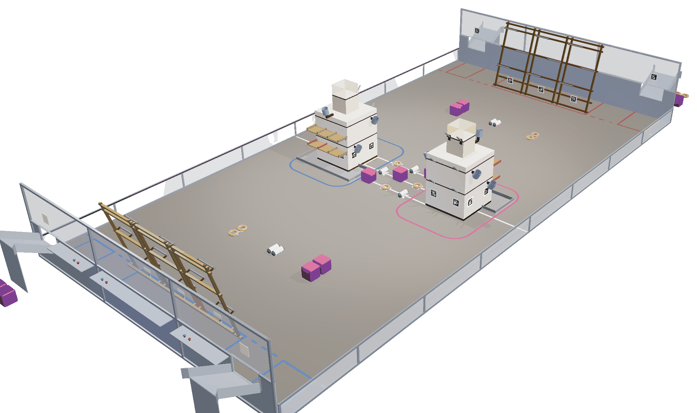
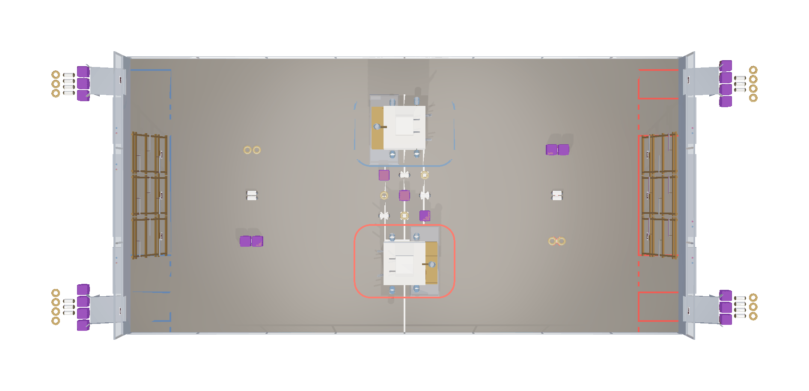
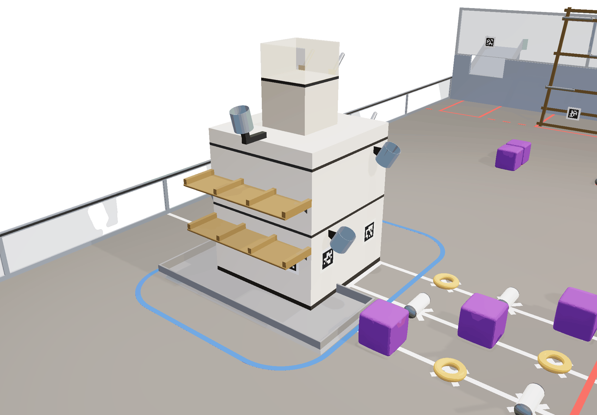
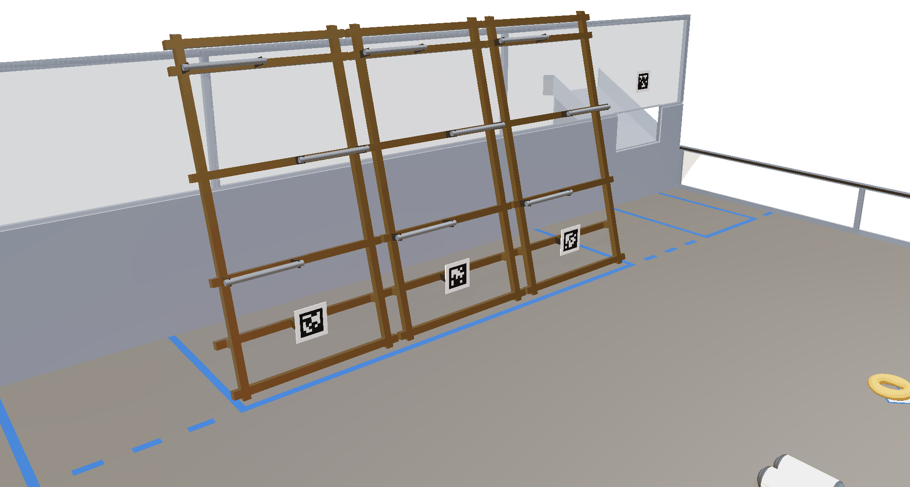
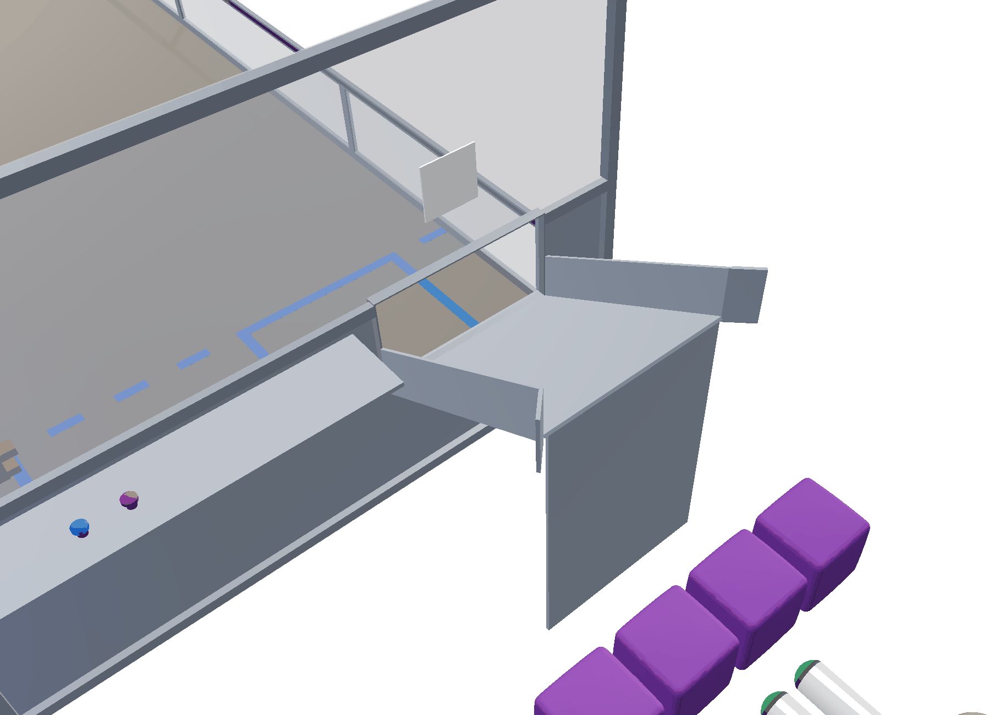
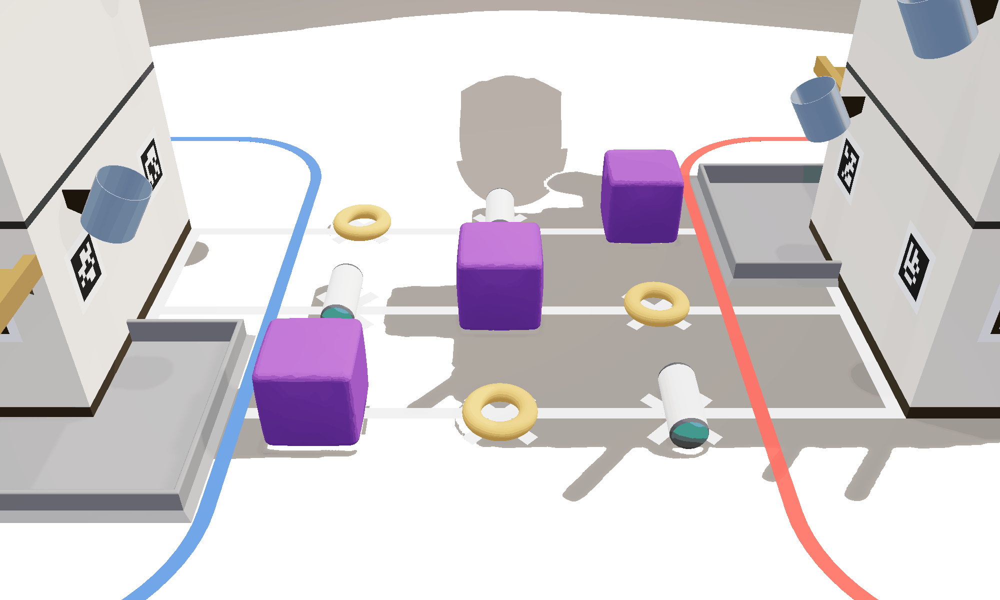

# SUMMIT PUSH — Official Game Manual

*An original offseason game for competitive-robotics design training · Version 2.2*

---

**Contents**

1. Introduction
2. Game Overview
3. ARENA
4. Match Play & Scoring
5. Game Rules (G)
6. Robot Construction Rules (R)
7. Inspection & Eligibility
8. Tournament
9. Glossary

<!-- Compiled file. The source sections are in 02-manual/sections/. Edit those files and rebuild with `bash 02-manual/build.sh`; do not edit this file directly. -->

---
# 1 Introduction

## 1.1 About SUMMIT PUSH

SUMMIT PUSH is an original offseason game, published as a design-training release for competitive robotics programs. This manual defines the game, the ARENA, the rules of play, the ROBOT construction rules, and the tournament structure. SUMMIT PUSH has no physical competition field. Every dimension, rule, and scoring value is nonetheless written for one, so that teams can design ROBOTS against it as they would for a competition season.

- **Authority.** Where any other document in the SUMMIT PUSH package (CAD packages, drawings, the vision guide) appears to conflict with this manual, this manual governs, with one exception. The design specification (`01-design/DESIGN-SPEC.md`) is the source document from which this manual was written; any discrepancy found between the two is reported to the event organizer and resolved in the specification's favor.
- **Defined terms.** Words in ALL CAPITAL LETTERS (e.g., CRAG, SCORED, MATCH) are defined terms. Each is defined at first use and collected in the Glossary (Section 9). When a rule uses a defined term, the definition governs over the everyday meaning of the word. Feature names that are not defined terms, such as Low Socket, Shelf 1, and slot fence, appear in title case.
- **Rule numbers.** Game rules carry G numbers and robot construction rules carry R numbers. Section 1.4 gives the numbering scheme.
- **Interpretation.** Referees, and in a design challenge the judges, enforce the rules as written. Teams raise ambiguities through the Q&A process rather than exploiting them (see Section 1.3).

## 1.2 Design Intent

The rules follow from four design decisions. They are stated here so that teams can read the rules in light of them.

**Three GAME PIECE shapes.** A cube, a cylinder, and a torus each pose a different manipulation problem. The CACHE CRATE needs a wide, compliant intake and flat placement. The O2 CELL needs ground pickup of a rolling body, reorientation, and insertion. The ROPE COIL needs precise hanging on an inclined peg. No single end effector handles all three well, so ALLIANCES specialize and cooperate.

**Uniform values by tier.** Every scoring position at a given height tier is worth the same, whatever the piece type. Placement value depends only on height, so no piece type or ROBOT archetype is penalized.

**FORECAST and ROUTE DECLARATION.** The FORECAST is random and applies only during AUTO. It is worth preparing for because ROPED UP requires two of the PRIORITY SUPPLY: four of the five required SUPPLIES are fixed by type, and the doubled type is not known until T = 0. The ROUTE DECLARATION is a strategic choice, made before the MATCH and public, so opponents can scout and counter it. The three ROUTE uplifts are scaled to tier difficulty so that no declaration is always best; the right choice depends on what the ALLIANCE can reliably complete.

**ENDGAME weighting.** HEADWALL climbs are worth enough to decide a close MATCH, but not enough to outweigh two minutes of cycling. Climbing is legal throughout the MATCH. Contact protection applies only during the final 30 seconds and the climb assessment that follows.

## 1.3 The MOUNTAIN ETHIC

Everyone taking part in SUMMIT PUSH is bound by the MOUNTAIN ETHIC, the game's code of conduct. It has three parts.

**Respect for opponents and partners.** Teams play to win within the rules and their spirit, and do not look for loopholes in the wording to use against other teams. Teams offer help to any ALLIANCE partner or opponent whose ROBOT is down, and treat everyone at the event with respect.

**Integrity toward referees.** Referees enforce the rules under time pressure and without replay. Teams accept their calls, including close ones. Disagreements go through the question box (Section 4.9) and the Q&A process; teams do not argue calls at the FIELD.

**Safety first.** No point value in this manual is worth an injury. Where competitive advantage conflicts with the safety of people, ROBOTS, or the FIELD, safety takes priority.

SUMMIT PUSH includes defense, contested space, and a protected ENDGAME, so competitive friction will occur. What matters is how a team behaves when it does. Winning a MATCH by exploiting an unintended reading of a rule, or by playing recklessly around a partner's climb, is contrary to the MOUNTAIN ETHIC.

> *Commentary:* The conduct rules apply in full when SUMMIT PUSH is run as a design exercise. In a design challenge, the MOUNTAIN ETHIC governs how entrants treat competing entries, judges, and organizers.

## 1.4 Document Conventions

**Rule numbering.** Rules are grouped by number band:

**Table 1-1: Rule number bands**

| Band | Scope |
|---|---|
| **G1xx** | Personal safety |
| **G2xx** | Conduct |
| **G3xx** | Pre-MATCH (setup, starting configuration, ROUTE DECLARATION) |
| **G4xx** | In-MATCH robot rules (movement, contact, zones, ENDGAME) |
| **G5xx** | Game piece rules (possession, scoring, de-scoring) |
| **R1xx** | Robot size and weight |
| **R2xx** | Safety and materials |
| **R3xx** | Budget and fabrication |
| **R4xx** | Bumpers |
| **R5xx** | Motors and actuators |
| **R6xx** | Power distribution |
| **R7xx** | Control system |
| **R8xx** | Pneumatics |

**Violations.** Each rule that can be violated states its consequence in a *Violation:* line. In-MATCH penalties use the taxonomy in Section 4.8. Rules enforced at INSPECTION, and the few rules that forfeit a specific credit, state their consequence directly.

- **VERBAL WARNING:** no points. A recorded warning for a first-instance, low-impact infraction; warnings persist for the team for the remainder of the event.
- **MINOR FOUL:** 3 points credited to the opposing ALLIANCE.
- **MAJOR FOUL:** 8 points credited to the opposing ALLIANCE.
- **YELLOW CARD:** a warning for egregious behavior or for specific listed violations. A second YELLOW CARD in the same tournament phase escalates to a RED CARD.
- **RED CARD:** disqualification for the MATCH.

**Examples and commentary.** Text labeled *Example:* shows how a rule applies and is a binding interpretation. Text labeled *Commentary:* explains design intent and is not binding; the rule text governs.

**Cross-references.** Sections are numbered for citation: "Section 4.3" in running text, "§4.3" in tables and boxes. Rules are cited by number (e.g., **G405**).

## 1.5 Team Updates

The event organizer may issue Team Updates at any time during an event. A Team Update may correct an error, resolve an ambiguity raised through the Q&A process, or, rarely, change a rule or value. Each Team Update is numbered and dated. The most recent Team Update supersedes conflicting text in this manual and in earlier updates. Teams are responsible for working to the manual as updated and should check for Team Updates before finalizing a design.

---

# 2 Game Overview

## 2.1 The Setting

SUMMIT PUSH has a mountaineering theme. Each ALLIANCE is an expedition with one short weather window, the length of a MATCH, to stock its route up a shared peak before a storm closes the mountain.

ROBOTS carry three kinds of SUPPLIES to their ALLIANCE's CRAG, a rock spire at midfield: CACHE CRATES of food and shelter go on shelves, O2 CELLS of oxygen go into angled sockets, and ROPE COILS of climbing line hang on pegs. Stocking a tier of the CRAG establishes a CAMP and lights that tier's ring in the ALLIANCE's color. Establishing all three CAMPS (CAMP I, CAMP II, and HIGH CAMP) lights the SUMMIT BEACON at the top of the spire.

When the MATCH starts, the FORECAST (WHITEOUT, ICEFALL, or GALE) names the SUPPLY whose placement points are doubled during AUTO. Before the MATCH, each ALLIANCE declares a ROUTE: low, mid, or high. The CAMP on the declared ROUTE pays a larger bonus, and higher ROUTES pay more. At the end of the MATCH, ROBOTS score for how high they have climbed the HEADWALL, a leaning three-lane truss at their own end of the FIELD, with rungs rising from the LEDGE RUNG to the CAMP RUNG to the SUMMIT RUNG.

*Figure 2-1. The SUMMIT PUSH FIELD, seen from above the Blue alliance wall. The dimensioned drawings are in Appendix A of the PDF edition and in 03-field/renderings.*

## 2.2 The Match

SUMMIT PUSH is played by two ALLIANCES of three teams each on a 54 ft × 27 ft carpeted FIELD. Each MATCH is 2 minutes 30 seconds long: a 15-second AUTONOMOUS period (AUTO), in which ROBOTS operate only on pre-programmed instructions, followed immediately by a 2-minute-15-second TELEOPERATED period (TELEOP), in which DRIVE TEAMS take control. The final 30 seconds of TELEOP is the ENDGAME period, during which HEADWALL protection is active.

**The FIELD.** Each ALLIANCE has one CRAG near midfield: a 48 in × 48 in structure rising to a spire top 90 in above the carpet. The CRAG is the ALLIANCE's only placement structure for SUPPLIES. Between the two CRAGS is the neutral CENTER CACHE, nine SUPPLIES staged across the centerline and contested by both ALLIANCES. Each ALLIANCE's end of the FIELD holds its BASECAMP zone (where ROBOTS start), its HEADWALL (a 144-in-wide climbing truss leaned 15° from vertical and split into three independent lanes), and two OUTFITTER chutes in the wall corners, through which HUMAN PLAYERS feed additional SUPPLIES onto the FIELD.

**The SUPPLIES.** There are three GAME PIECES, each a different shape and size:

**Table 2-1: The three SUPPLIES**

| SUPPLY | Shape | Size | Scores on |
|---|---|---|---|
| **CACHE CRATE** | Cube | 12.0 in | Shelves (24 / 42 in) and BASE DEPOT |
| **O2 CELL** | Cylinder | 5.0 in dia × 14.0 in | Sockets (30 / 54 / 72 in) and BASE DEPOT |
| **ROPE COIL** | Torus | 10.0 in OD | 45° pegs (30 / 54 / 78 in) and BASE DEPOT |

A ROBOT may possess at most 2 SUPPLIES at a time. Each CRAG also has a floor-level BASE DEPOT tray that accepts any SUPPLY in any orientation.

**Placement values.** Every Low-tier scoring position is worth the same, every Mid-tier position is worth the same, and every High-tier position is worth the same, regardless of which SUPPLY it takes. Value rises with height.

**ROUTE DECLARATION.** During setup, each ALLIANCE declares its ROUTE: LOW ROUTE, MID ROUTE, or HIGH ROUTE. An ALLIANCE that makes no declaration is assigned LOW ROUTE. The CAMP bonus matching the declared ROUTE pays its declared value for the entire MATCH (CAMP I +6→+18, CAMP II +10→+24, HIGH CAMP +15→+35). The declared ROUTE is shown on the FIELD LEDs at MATCH start, so opponents can scout it.

**The FORECAST.** When AUTO begins, the Field Management System (FMS) broadcasts one character of game data, `W` (WHITEOUT), `I` (ICEFALL), or `G` (GALE), and the FIELD LEDs display it in white. The FORECAST names the MATCH's PRIORITY SUPPLY (WHITEOUT = CACHE CRATES, ICEFALL = O2 CELLS, GALE = ROPE COILS). Placement points for the PRIORITY SUPPLY are doubled during AUTO, and ROPED UP requires two of it. AUTO routines must read the game data and branch between at least three prepared routines. Events without FMS game data use the card-draw fallback in Section 4.3.1.

**AUTO.** Each ROBOT earns 3 points for LEAVE (fully exiting BASECAMP). SUPPLIES score at AUTO values, doubled for the PRIORITY SUPPLY. An ALLIANCE earns the ROPED UP bonus (+10) if all three ROBOTS LEAVE and it scores at least 5 SUPPLIES, including at least two of the PRIORITY SUPPLY and at least one of each other type. AUTO scores are assessed after a 3-second settle window at the end of the period.

**TELEOP.** ALLIANCES cycle SUPPLIES to their CRAG from their OUTFITTER chutes, the staged marks, and the contested CENTER CACHE. Establishing a CAMP (at least one of each required SUPPLY simultaneously SCORED at that tier) latches a bonus and lights that tier's LED ring on the CRAG: CAMP I (+6), CAMP II (+10), HIGH CAMP (+15), each paying its declared value if it matches the declared ROUTE. Establishing all three CAMPS lights the SUMMIT BEACON for a latched +10. SUPPLIES SCORED on a CRAG score for that CRAG's ALLIANCE regardless of which ROBOT placed them, and no ROBOT may remove a SCORED SUPPLY from either CRAG. Defense is legal except against a ROBOT on its own CRAG APRON, a ROBOT in its own OUTFITTER LANE, or, during the ENDGAME, a ROBOT in its own HEADWALL ZONE. ROBOTS may not enter an opponent's OUTFITTER LANE at any time, or an opponent's HEADWALL ZONE during the ENDGAME.

**ENDGAME.** Climbing the HEADWALL is legal at any time; HEADWALL ZONE protection applies from the start of the ENDGAME through climb assessment. Each of the three lanes carries three rungs: the LEDGE RUNG (30 in), CAMP RUNG (54 in), and SUMMIT RUNG (78 in). The rungs are staggered 12 in laterally to alternating sides and set back 6.4 in per step by the 15° lean. Each lane takes one ROBOT, and every climb must begin from the FIELD side of the truss. Climbs are assessed after the final buzzer, when all ROBOTS are at rest or at T+5 seconds, whichever comes first. PARK in BASECAMP scores 3; hanging solely from the LEDGE RUNG scores 12, from the CAMP RUNG 20, and from the SUMMIT RUNG 30. The maximum ALLIANCE climb total is 90.

## 2.3 Match at a Glance

**Table 2-2: MATCH at a glance**

| Phase | Duration | ROBOTS | What scores |
|---|---|---|---|
| **Setup** | pre-MATCH | Staged in BASECAMP; ≤1 preload each | ROUTE DECLARATION made (LOW default) |
| **AUTO** | 0:15 | Pre-programmed only; FORECAST broadcast at T=0 | LEAVE (3/robot); SUPPLIES at AUTO values (PRIORITY SUPPLY doubled); ROPED UP (+10); CAMPS may be established |
| **TELEOP** | 2:15 | Driver-controlled | SUPPLIES at TELEOP values; CAMP bonuses (declared ROUTE's CAMP uplifted); SUMMIT BEACON (+10); climbing legal at any time |
| **ENDGAME** *(final 0:30 of TELEOP)* | 0:30 | HEADWALL ZONE protection active | PARK (3); LEDGE RUNG (12); CAMP RUNG (20); SUMMIT RUNG (30) |
| **Settle** | 0:03 after AUTO and after the final buzzer; climbs assessed at rest or at +0:05 | Disabled at the final buzzer | Scores latch |

## 2.4 Scoring Quick Reference

**SUPPLY placement** (per SUPPLY; AUTO values apply to SUPPLIES whose last placing ROBOT contact occurred before the end of AUTO):

**Table 2-3: SUPPLY placement points**

| Tier | Positions | Height | AUTO | TELEOP |
|---|---|---|---|---|
| **Low** | Shelf 1 (3 slots), Low Sockets (×2), Low Pegs (×2) | 24 / 30 / 30 in | **7** | **4** |
| **Mid** | Shelf 2 (3 slots), Mid Sockets (×2), Mid Pegs (×2) | 42 / 54 / 54 in | **10** | **7** |
| **High** | Summit Socket (×1), High Pegs (×2) | 72 / 78 in | **13** | **10** |
| **BASE DEPOT** | any SUPPLY, any orientation (~12) | floor (4 in lip) | **4** | **2** |

**Table 2-4: Bonus and ENDGAME points**

| Achievement | Requirement | Points |
|---|---|---|
| LEAVE (AUTO) | ROBOT fully exits BASECAMP during AUTO | **3** per ROBOT |
| FORECAST double (AUTO) | PRIORITY SUPPLY placements during AUTO | AUTO value **×2** |
| ROPED UP (AUTO) | All 3 ROBOTS LEAVE and ≥5 SUPPLIES SCORED, including ≥2 of the PRIORITY SUPPLY and ≥1 of each other type | **+10** |
| CAMP I *(latched)* | ≥1 CACHE CRATE on Shelf 1, ≥1 O2 CELL in a Low Socket, ≥1 ROPE COIL on a Low Peg | **+6** *(+18 if LOW ROUTE)* |
| CAMP II *(latched)* | ≥1 CACHE CRATE on Shelf 2, ≥1 O2 CELL in a Mid Socket, ≥1 ROPE COIL on a Mid Peg | **+10** *(+24 if MID ROUTE)* |
| HIGH CAMP *(latched)* | O2 CELL in the Summit Socket, ≥1 ROPE COIL on a High Peg | **+15** *(+35 if HIGH ROUTE)* |
| SUMMIT BEACON *(latched)* | All three CAMPS established | **+10** |
| PARK | ROBOT in BASECAMP at climb assessment | **3** |
| LEDGE RUNG | Supported solely by the LEDGE RUNG | **12** |
| CAMP RUNG | Supported solely by the CAMP RUNG | **20** |
| SUMMIT RUNG | Supported solely by the SUMMIT RUNG | **30** |

**Fouls:** MINOR FOUL = **+3** to the opposing ALLIANCE; MAJOR FOUL = **+8** to the opposing ALLIANCE.

**Ranking:** Win 3 RP, Tie 1 RP, plus three bonus RPs: SUPPLY LINE (total SUPPLIES SCORED, BASE DEPOT included), EXPEDITION (CAMPS established), and ASCENT (ALLIANCE ENDGAME points). Section 4.7 gives the thresholds for each event tier.

> *Example:* Late in a MATCH, Blue, which declared MID ROUTE, completes CAMP II by hanging its first ROPE COIL on a Mid Peg (7 points) while a CACHE CRATE is already on Shelf 2 and an O2 CELL is in a Mid Socket. Blue scores 7 points for the placement plus a latched +24 CAMP II bonus (raised from +10 by the ROUTE DECLARATION). CAMP bonuses latch when the CAMP is established, so if the ROPE COIL is later dislodged without ROBOT contact, the bonus remains; FIELD STAFF restore the SUPPLY at the next safe opportunity.

> *Commentary:* Spectators can follow the score on the FIELD: SUPPLIES accumulate on the two spires, and tier rings light as CAMPS are established. In the final 30 seconds, up to six ROBOTS climb the two HEADWALLS, three per ALLIANCE side by side. A 30-point SUMMIT RUNG climb at the buzzer can decide a close MATCH, but it cannot outweigh two minutes of cycling.

---

# 3 ARENA

The SUMMIT PUSH ARENA includes all elements of the game infrastructure required to play a MATCH: the FIELD, two CRAGS, two HEADWALLS, four OUTFITTERS, 63 SUPPLIES, and the equipment for scorekeeping, field control, and MATCH lighting. This section is the authoritative physical description of the ARENA. Where an illustration in any other document disagrees with a dimension given here, this section governs.

> *Commentary:* The ARENA is illustrated throughout this manual with nominal dimensions. Fields are built by hand, so teams should expect variation of up to ±1 in and ±1° on non-critical dimensions and design accordingly. Dimensions flagged as toleranced (the O2 socket inside diameter, §3.3.2) are held to the stated tolerance on every official field. Every element is fully dimensioned for CAD reproduction in the FIELD CAD PACKAGE (`03-field/FIELD-CAD-PACKAGE.md`), and its appearance is specified in `03-field/MATERIALS-AND-COLORS.md`.

## 3.1 The FIELD

The FIELD is a 54 ft × 27 ft (648 in × 324 in) carpeted area bounded by guardrails and alliance walls. The guardrail is a 20-in-tall barrier along the long sides and parts of the short sides of the FIELD. Each short end of the FIELD is closed by an alliance wall: a solid barrier containing three standard driver stations, one per team on the ALLIANCE. Each driver station provides a shelf, a clear polycarbonate window, the standard FMS connection point for the OPERATOR CONSOLE, and FIELD-provided **E-STOP** and **A-STOP** buttons. The E-STOP renders that team's ROBOT inoperable for the remainder of the MATCH. The A-STOP ends that ROBOT's AUTO immediately; the ROBOT may then be enabled normally at the start of TELEOP. Any DRIVE TEAM member may press either button at any time (see **G401**). Each alliance wall has two OUTFITTER chute openings near its corners (Section 3.5).

*Figure 3-1. FIELD layout in plan view, Blue alliance wall at left. Dimensioned drawing: Plate 1 of the field drawing set.*

### 3.1.1 Coordinate Frame

All coordinates in this manual, in the FIELD drawings, and in the AprilTag layout file use a single always-blue-origin NWU convention:

- **Origin:** the right-hand corner of the Blue alliance wall as seen from the Blue driver stations looking down-field, where the Blue alliance wall meets the guardrail at Y = 0.
- **+X** points down-field from the Blue alliance wall toward the Red alliance wall.
- **+Y** points to the left from the Blue drivers' perspective.
- **+Z** points up from the carpet.

The FIELD centerline is the line X = 324. The FIELD center is (324, 162). Heights ("Z") are measured from the carpet surface. The FIELD layout is 180° rotationally symmetric about the FIELD center: every Red element is the Blue element rotated 180° about (324, 162). Both ALLIANCES use this one coordinate frame; it is never flipped for Red.

### 3.1.2 FIELD LEDs

Each long-side guardrail (Y = 0 and Y = 324) carries a continuous 1.0-in-wide LED band set into its top rail, with a frosted lens facing inward and the lens center 19.0 in above the carpet. Each band is divided at the FIELD centerline into two 324-in ALLIANCE segments, so each ALLIANCE has two segments, one on each side of the FIELD. Segment states:

- **Green:** the FIELD is safe for team members to enter or reach over (**G101**).
- **White:** the FORECAST, displayed in both ALLIANCES' segments at T = 0 of AUTO (Section 4.3.1). One lit block means WHITEOUT, two ICEFALL, three GALE.
- **ALLIANCE color:** that ALLIANCE's declared ROUTE, from the "field ready" signal through MATCH start (Section 4.2.3, **G304**). One lit block means LOW ROUTE, two MID ROUTE, three HIGH ROUTE.
- **Dark:** at all other times.

FIELD LEDs are indicators only and are never the scoring or safety authority. FIELD STAFF direction governs FIELD entry, and referee-recorded state governs scoring.

## 3.2 Zones and Markings

All zone boundaries are marked with tape on the carpet. ALLIANCE-specific zones are marked in the owning ALLIANCE's color; neutral marks are white. The tape is part of the zone it bounds: a zone extends to the outer edge of its tape.

**Table 3-1: Zones and markings**

| Zone / mark | Alliance | Boundary (coordinates) | Size |
|---|---|---|---|
| **BASECAMP** (= **HEADWALL ZONE**) | Blue | X 0–48, Y 90–234 | 48 in deep × 144 in wide |
| | Red | X 600–648, Y 90–234 | mirror |
| **OUTFITTER LANE** (×2 per alliance) | Blue | 36 in wide, centered on each chute (Y = 30 and Y = 294), extending 48 in into the FIELD from the alliance wall (X 0–48) | 36 × 48 in each |
| | Red | X 600–648, centered Y = 294 and Y = 30 | mirror |
| **CRAG APRON** | Blue | offset **36 in** outward from the SHELF FACE and the PEG FACE, **20 in** outward from each SOCKET FACE, corners swept as 20-in-radius arcs | band around the CRAG |
| | Red | mirror | mirror |
| **CLIMB LINE** | alliance color, dashed outside BASECAMP | the X = 48 (Blue) / X = 600 (Red) line carried across the full FIELD width, Y 0–324; over Y 90–234 it coincides with the BASECAMP boundary and needs no second line | the plane **G416** is called against |
| **FIELD centerline** | neutral white | 2-in line at X = 324 running the full width, Y 0–324, interrupted where the two CRAG footprints cross it (the BASE DEPOT trays stop 8 in short of the line) | the line **G402** and **G502** are both called against |
| **CENTER CACHE band** | neutral | X 300–348, Y 108–216 | 48 × 108 in |
| **CENTER CACHE staging marks** | neutral | 9 white taped marks in a 3 × 3 grid, 24 in spacing, centered on (324, 162) | grid at X = 300/324/348 × Y = 138/162/186 |
| **Alliance staging marks** | Blue | 3 taped marks at X = 144; Y = 108, 162, 216 | 12 ft from the Blue alliance wall |
| | Red | X = 504; Y = 108, 162, 216 | mirror |

BASECAMP is the taped area between each alliance wall and its HEADWALL. ROBOTS begin every MATCH in their BASECAMP (Section 3.2.1). The same taped area is also the HEADWALL ZONE: during the ENDGAME period and the climb assessment that follows it, opponent contact with a ROBOT in this zone is penalized (**G412**). The two names refer to the same taped area. BASECAMP describes its starting and parking role, and HEADWALL ZONE its ENDGAME protection role.

OUTFITTER LANES are protected loading corridors: opponents may not enter them or contact ROBOTS in them (**G410**). The CRAG APRON is a line-call placement protection at each ALLIANCE's own CRAG: a ROBOT whose BUMPERS intersect its own ALLIANCE's APRON may not be contacted by an opponent (**G407**). The APRON does not restrict an opponent's movement through the area when no protected ROBOT is present.

The APRON offset is 36 in on the SHELF FACE and the PEG FACE and 20 in on the two SOCKET FACES. At a SOCKET FACE, the shallower offset limits protection. A socket rim stands 8.0 in out from its face, so a ROBOT using the full 18-in extension has its FRAME PERIMETER 26 in out and its BUMPERS 23 in out: 3 in beyond the 20-in tape, and unprotected. To be protected at a SOCKET FACE, a ROBOT must engage the rim with 15 in of extension or less. At the SHELF FACE and PEG FACE, with their 36-in offset, every reachable position is protected.

The SOCKET FACE offset is reduced for space. The corridor between the two CRAGS is 108 in wide (Y 108–216), and the staged CENTER CACHE occupies Y 131.5–192.5 of it, measured across the crowned 13.0-in crate envelope. Two 36-in APRONS would leave only 36 in of corridor and would cover the staged SUPPLIES. With 20-in APRONS on the SOCKET FACES, the two APRONS occupy Y 108–128 and Y 196–216, leaving a 68-in open corridor that contains the whole CENTER CACHE with 3.5 in of clearance at each end. That corridor, and every transit lane on the FIELD, remains fully open to defense.

> *Example:* A Red ROBOT drives through the Blue CRAG APRON while no Blue ROBOT is nearby. No rule is violated. The APRON restricts contact with a protected ROBOT and places no limit on movement through it.

### 3.2.1 Starting Positions

Immediately before the MATCH, each ROBOT must be positioned entirely within its ALLIANCE's BASECAMP and in contact with its alliance wall. Each ROBOT may hold up to one preloaded SUPPLY of any type (Section 3.6.1).

> *Commentary:* BASECAMP is the wedge under the leaning HEADWALL, so the clear height available to a ROBOT falls as it moves down-field. The lower face of the truss lies at X = 41.79 − 0.268·Z for Blue, so the clear height at any X is H(X) = 3.732 × (41.79 − X), and the lower crossbeam limits it to 10.8 in between X = 34.2 and 38.6. A ROBOT has 42.0 in of clearance anywhere up to X = 30.5. A ROBOT at the 42-in starting height of **R104** therefore stages against the alliance wall, which is why the contact requirement names the wall rather than the truss. The full clear-volume curve is published in the FIELD CAD PACKAGE §4.1.

## 3.3 The CRAG

Each ALLIANCE owns one CRAG: a rock-spire scoring structure straddling the FIELD centerline. The Blue CRAG is centered at (324, 240) and the Red CRAG at (324, 84). Each CRAG has a 48 × 48 in footprint and rises to a spire top 90 in above the carpet. The body of the CRAG presents four vertical scoring faces around the footprint; a central spire carries the highest scoring features and the SUMMIT BEACON.

Face names are assigned from the owning ALLIANCE's approach:

**Table 3-2: CRAG faces by ALLIANCE**

| Element | Blue CRAG | Red CRAG | Features |
|---|---|---|---|
| **SHELF FACE** | −X face (plane X = 300), faces the Blue alliance wall | +X face (plane X = 348), faces the Red alliance wall | Shelf 1, Shelf 2, the Summit Socket, the BASE DEPOT |
| **SOCKET FACE** ×2 | ±Y faces (planes Y = 216 and Y = 264) | ±Y faces (planes Y = 60 and Y = 108) | one Low Socket and one Mid Socket per face |
| **PEG FACE** | +X face (plane X = 348), faces the Red alliance wall | −X face (plane X = 300), faces the Blue alliance wall | Low and Mid Pegs |
| **spire** | top of structure | top of structure | High Pegs, SUMMIT BEACON |

Because each CRAG has scoring features on all four faces, no defender can block every approach at once.

*Figure 3-2. The Blue CRAG, seen from its SHELF FACE and −Y SOCKET FACE. Dimensioned drawing: Plate 2 of the field drawing set.*

### 3.3.1 SHELF FACE

The SHELF FACE carries two horizontal shelves spanning the width of the face:

- **Shelf 1:** shelf top surface at 24 in, divided into 3 slots, each 14.0 in wide, separated by slot fences 1.5 in wide and 2.0 in tall. Slot centers lie at −15.5, 0, and +15.5 in from the face centerline.
- **Shelf 2:** shelf top surface at 42 in, same slot layout.

Shelves are 14.0 in deep and accept CACHE CRATES only, placed flat. A CACHE CRATE rests on its bottom crown, so its side faces reach their full 0.5-in bulge 6.5 in up, well above the 2.0-in fences. At the fence tops the crate is 12.44 in across, which gives a placement 0.78 in of lateral tolerance per side, and its 13.0-in crown clears the fences entirely. Crates in adjacent slots clear each other by 2.5 in. Each shelf slot SCORES at most one SUPPLY (six crates per CRAG on shelves). Extra SUPPLIES resting in or on an occupied slot are not SCORED and satisfy no requirement (Section 4.4.1).

### 3.3.2 SOCKET FACES and the Summit Socket

Each of the two SOCKET FACES carries two open-topped cylindrical sockets, loaded from above. Every socket's rim center stands 8.0 in out from its face plane, measured normal to the face, on a bracket beneath the tube:

- **Low Socket:** rim at 30 in, ±14.0 in lateral on the shelf-face side of the face centerline, tube tilted 30° from vertical, tilting outward toward the approaching ROBOT. One per SOCKET FACE (2 per CRAG).
- **Mid Socket:** rim at 54 in, ±14.0 in lateral on the peg-face side, tube tilted 30° from vertical. One per SOCKET FACE (2 per CRAG).
- **Summit Socket:** one per CRAG, on the SHELF FACE, on the CRAG's centerline, rim at 72 in, tube tilted 15° from vertical, tilting outward toward the owning ALLIANCE. A SCORED O2 CELL leans out of it toward the owning ALLIANCE's driver stations.

Sockets accept O2 CELLS only. Each socket SCORES at most one SUPPLY; extra SUPPLIES resting in or on an occupied socket are not SCORED and satisfy no requirement. The tube is 7.0 in long along its axis with a closed bottom, so a seated 14.0-in O2 CELL stands 7.0 in proud of the rim along the axis, where it is visible from the driver stations and the referee positions.

The two sockets on a face have different approach standoffs. The BASE DEPOT's corner arm runs 16.0 in along each SOCKET FACE from the SHELF FACE, and the Low Socket sits directly above it, so a ROBOT servicing the Low Socket parks against the arm and reaches 11.75 in. The Mid Socket, on the PEG FACE side, is clear of the arm and is 5.0 in of reach from BUMPERS on the face. Both are inside the **R105** limit.

**Toleranced dimension:** socket inside diameter 6.50 in ± 0.125 in. This dimension is held to the stated tolerance on every official field and is carried as a toleranced callout in the FIELD CAD PACKAGE drawing set. It provides 0.75 in of nominal radial clearance per side (1.50 in on diameter) for the 5.0-in O2 CELL.

> *Commentary:* The socket tolerance is called out because the insertion task depends on it. At 6.50 in ID the task is achievable with reasonable alignment; a field-build error that narrows the mouth makes it much harder. FIELD STAFF verify this dimension at field setup.

### 3.3.3 PEG FACE and High Pegs

The PEG FACE carries four pegs, and the spire carries two more:

- **Low Pegs** ×2, roots at 30 in, ±14.0 in from the face centerline
- **Mid Pegs** ×2, roots at 54 in, ±14.0 in from the face centerline
- **High Pegs** ×2 on the spire, roots at 78 in, ±7.0 in from the spire centerline

All pegs are 1.5 in OD, angled 45° upward from the face, with 10.0 in exposed and a fully rounded tip. Pegs accept ROPE COILS only, hung over the peg. Each peg SCORES at most one SUPPLY; extra SUPPLIES resting in or on an occupied peg are not SCORED and satisfy no requirement. Peg heights are measured to the peg root at the face.

A ROPE COIL dropped over a peg settles into a near-vertical plane parallel to the CRAG face and wedges there. The 5.0-in hole over a 1.5-in peg permits at most about 48° (47.9°) of tilt away from perpendicular, and a vertical hang requires 45°, so a SCORED ROPE COIL is held captive rather than balanced. Its center comes to rest roughly 1 in above the peg root.

### 3.3.4 BASE DEPOT

The BASE DEPOT is a floor tray running along the base of the SHELF FACE and wrapping 16.0 in around both of that face's corners onto the SOCKET FACES. Its floor sits 0.25 in above the carpet, and its lip top is 4.0 in above the carpet. The channel is 16.0 in deep, measured from the CRAG face. In plan it is a continuous open-topped U: a 16 × 80 in outer leg parallel to the SHELF FACE, closed at both ends by the corner squares, with a 16 × 16 in arm running back along each SOCKET FACE.

The shelves overhang 14.0 in of the channel and span only the 48-in width of the SHELF FACE. From above, the outer 2.0 in of the shelf-face leg is open, as are both outer corner squares and part of each corner arm. Each arm is overhung by its Low Socket tube, so only the corner squares are wide enough to drop a CACHE CRATE or a ROPE COIL straight in. The rest of the shelf-face leg is loaded by pushing SUPPLIES in over the lip; there is at least 19.0 in of clearance beneath Shelf 1 and its gussets, against a crowned CACHE CRATE's 13.0 in.

The DEPOT accepts any SUPPLY in any orientation, whether pushed, dropped, or placed. Because a SUPPLY resting on another is not SCORED (Section 4.4.1), capacity is a single-layer packing limit: roughly 8 CACHE CRATES, or about 12 SUPPLIES in a mixed load.

A SUPPLY is SCORED in the BASE DEPOT when it is at rest, its only support is the tray floor, and it lies entirely within the vertical projection of the DEPOT channel. A SUPPLY supported by the lip, by the carpet outside the tray, or by another SUPPLY is not SCORED. A SUPPLY that stands taller than the 4-in lip is SCORED as long as the tray floor alone supports it. FIELD STAFF may level heaped SUPPLIES during MATCH stoppages; they do not otherwise adjust DEPOT contents during a MATCH.

> *Example:* A ROPE COIL lands draped over the DEPOT lip, half in and half out. It is not SCORED, because the lip carries part of its weight. A second ROPE COIL thrown onto a full tray comes to rest on other ROPE COILS rather than on the tray floor, so it is not SCORED either. A CACHE CRATE standing on the tray floor rises well above the lip and is SCORED.

### 3.3.5 Tier LED Rings and SUMMIT BEACON

Each CRAG carries three LED tier rings around the structure at 30 in, 54 in, and 78 in, and a SUMMIT BEACON: the top 12 in of the spire (Z 78 to 90) is a translucent lantern with its luminous center at 84 in.

- A tier ring lights in the owning ALLIANCE's color when the corresponding CAMP is established (30 in → CAMP I, 54 in → CAMP II, 78 in → HIGH CAMP). Tier rings latch: once lit, a ring stays lit for the remainder of the MATCH, even if SUPPLIES are later dislodged.
- The SUMMIT BEACON lights when all three CAMPS are established.
- The FORECAST (white) and each ALLIANCE's declared ROUTE are displayed on the FIELD LEDs (Section 3.1.2), not on the tier rings (see Section 4.2.3 and Section 4.3.1). A tier ring shows latched CAMP state only, so it never changes color or pattern once lit.

The LEDs are decorative confirmation only and are never the scoring authority. A CAMP is established at the moment its required SUPPLIES are simultaneously SCORED, as determined by referees and the scoring system, whether or not the corresponding ring lights. If lighting and the SCORED state ever disagree, the SCORED state governs.

### 3.3.6 CRAG APRON

The CRAG APRON (Section 3.2) is the taped boundary offset 36 in outward from the SHELF FACE and the PEG FACE and 20 in outward from each SOCKET FACE, with 20-in-radius arcs sweeping the corners. Each APRON is taped in its CRAG's ALLIANCE color. It protects ROBOTS of the owning ALLIANCE whose BUMPERS intersect it from opponent contact (**G407**). **G402**, **G403**, **G501**, and **G502** also refer to it.

## 3.4 The HEADWALL

Each ALLIANCE has one HEADWALL: a climbing truss standing in front of its alliance wall. All HEADWALL geometry derives from one reference plane, PLANE P. PLANE P contains the horizontal line {X = 48 (Blue) / X = 600 (Red), Z = 0} spanning Y 90–234, and is tilted 15° from vertical with its top leaning toward the alliance wall. ROBOTS climb on the FIELD side of PLANE P.

Each HEADWALL is 144 in wide and divided into three independent 48-in lanes (Blue lane centers at Y = 114, 162, 210). The lanes are structurally independent: load or motion in one lane does not disturb the others. One ROBOT per lane (**G415**).

*Figure 3-3. The Blue HEADWALL: three independent lanes, each with a LEDGE RUNG, a CAMP RUNG and a SUMMIT RUNG. Dimensioned drawing: Plate 3 of the field drawing set.*

Each lane carries three rungs of 1.5 in OD and 20.0 in length, with their centerlines lying in PLANE P:

**Table 3-3: HEADWALL rungs**

| Rung | Height (carpet to top of rung) | Lateral offset from the lane centerline (identical in all three lanes) |
|---|---|---|
| **LEDGE RUNG** | 30 in | −12.0 in |
| **CAMP RUNG** | 54 in | +12.0 in |
| **SUMMIT RUNG** | 78 in | −12.0 in |

Because of the 15° lean, each rung sits approximately 6.4 in horizontally behind (toward the alliance wall from) the rung below it. The lateral stagger is the same in every lane: LEDGE −12, CAMP +12, SUMMIT −12. Successive rungs within a lane are therefore 24.0 in apart center-to-center, while rungs at the same height in adjacent lanes stay 48.0 in apart (28.0 in end to end, which leaves room for three ROBOTS to hang side by side).

A 20.0-in rung centered 12.0 in off the lane centerline leaves no lateral position that engages two successive rungs: the LEDGE RUNG spans lane-centerline −22 to −2 while the CAMP RUNG spans +2 to +22. A climber therefore cannot follow the rung line with one fixed hook pair. Only two non-overlapping lateral positions fit a 20.0-in rung in a 48-in lane, so the stagger alternates with period two, and the LEDGE and SUMMIT RUNGS share the −12.0 offset while the CAMP RUNG sits at +12.0.

There are two routes to the top, and both are legal:

- the two-handoff traversal, LEDGE → CAMP → SUMMIT, each step 24 in up, 6.4 in back, and 24 in across; or
- a direct LEDGE → SUMMIT reach at one lateral position, 48 in up and 12.9 in back (49.7 in measured in PLANE P, against 24.9 in for a single step).

The direct route replaces all the lateral motion with twice the vertical reach in one move, which requires the harder mechanism. Most climbers are expected to use the traversal.

All truss structure lies at least 4.0 in behind PLANE P, measured normal to PLANE P, except the two end brackets of each rung, which may enter that band within 2.0 in of the rung end. Hook wrap is therefore clear over the middle 16.0 in of every 20.0-in rung, and a hook must engage inside that band.

The taped HEADWALL ZONE (coincident with BASECAMP, Section 3.2) lies beneath and behind the HEADWALL, between the truss base and the alliance wall. From the start of the ENDGAME period until climb assessment is complete, an opponent that contacts a ROBOT in this zone commits a MAJOR FOUL, and an additional MAJOR FOUL and a YELLOW CARD if the contact blocks or displaces a climb, as when a hanging ROBOT falls (**G412**). Climbing is legal at any time in the MATCH; the zone protection applies only in that window. A ROBOT may not contact a rung while any part of its BUMPERS is on the alliance-wall side of the CLIMB LINE (X = 48 in for Blue, X = 600 in for Red) unless it is then supported solely by rungs, or is still touching a rung it took hold of while so supported within the preceding 5 seconds (**G416**).

> *Commentary:* The three-lane design lets all three ROBOTS of an ALLIANCE climb at the same time without traffic conflict. The difficulty comes from the 15° lean and the 24-in lateral alternation. **G416** exists because the truss leans back over BASECAMP: without it, a ROBOT could park under the SUMMIT RUNG and reach it with a purely vertical mast, and the traversal would be unnecessary.

## 3.5 OUTFITTERS

Each ALLIANCE has two OUTFITTERS, one at each corner of its alliance wall. Each OUTFITTER consists of a chute opening through the alliance wall, a human-player station behind it, and the taped OUTFITTER LANE in front of it.

*Figure 3-4. A Blue OUTFITTER seen from behind the alliance wall: SUPPLIES are fed down the ramp and through the chute opening onto the FIELD. Dimensioned drawing: Plate 4 of the field drawing set.*

- **Chute opening:** 30 in wide × 16 in tall, with the sill (bottom edge) at 24 in above the carpet, so the opening spans Z 24–40. Blue chutes are centered at (0, 30) and (0, 294); Red chutes at (648, 294) and (648, 30). The 16-in height clears the 12.0-in CACHE CRATE, whose pillowed faces give it a 13.0-in maximum envelope, with 3.0 in to spare.
- **Human players:** exactly one HUMAN PLAYER is stationed at each OUTFITTER, two per ALLIANCE. They may come from any of the ALLIANCE's three DRIVE TEAMS and are assigned before the "field ready" signal (**G307**). HUMAN PLAYERS feed SUPPLIES through the chute onto the FIELD. A SUPPLY may be slid, dropped, or rolled through the chute. HUMAN PLAYERS may break the plane of the chute opening with their hands, and no further (**G102**).
- **Stock:** all SUPPLIES not staged on the FIELD or preloaded (Section 3.6.1) begin the MATCH stocked at the ALLIANCE's two OUTFITTERS, divided between them at the ALLIANCE's discretion.
- **Restocking:** FIELD STAFF return any SUPPLY that leaves the FIELD, at the next safe opportunity, to the nearest OUTFITTER chute: the chute of the ALLIANCE on that side of the FIELD, which may be the opposing ALLIANCE's chute (**G507**). The SUPPLY re-enters play through normal human-player feeding. SUPPLIES are never re-staged to FIELD marks during a MATCH.

The OUTFITTER LANE (36 in wide × 48 in deep, Section 3.2) in front of each chute is a no-defense zone: opponents may not enter it or contact ROBOTS within it (**G410**).

## 3.6 SUPPLIES

SUMMIT PUSH is played with three SUPPLY types: 63 SUPPLIES per MATCH in total, 21 of each type. "SUPPLY" and "GAME PIECE" are synonymous; SUPPLY is the term used in the rules.

**Table 3-4: SUPPLY specifications**

| | **CACHE CRATE** | **O2 CELL** | **ROPE COIL** |
|---|---|---|---|
| Shape | cube, pillowed faces | cylinder, domed caps | torus (ring) |
| Dimensions | 12.0 in cube (13.0 in max envelope with the 0.5-in face crown) | 5.0 in dia × 14.0 in long | 10.0 in OD, 2.5 in tube (5.0 in ID hole) |
| Weight | ~2.0 lb | ~1.5 lb | ~1.0 lb |
| Official construction | sewn ripstop-nylon skin over PU foam core | 4.0-in OD rigid tube core, 0.5-in EVA foam sleeve, molded foam caps | solid molded rubber/foam ring |
| Official color | expedition violet `#7B3FA0` | body `#F2F2F0`, domed caps `#2E8B57` | amber `#D9A441` |
| Scores on | Shelves, BASE DEPOT | Sockets, BASE DEPOT | Pegs, BASE DEPOT |
| Count per MATCH | 21 | 21 | 21 |

All three SUPPLY types are durable enough to be driven over. A SUPPLY damaged beyond play is removed and is not replaced during the MATCH. No SUPPLY is colored in either ALLIANCE's color, so a referee, a DRIVE TEAM, or a vision pipeline cannot mistake a SUPPLY for an ALLIANCE element.

### 3.6.1 Staging

At the start of each MATCH, SUPPLIES are staged as follows:

**Table 3-5: SUPPLY staging at the start of a MATCH**

| Location | Supplies | Detail |
|---|---|---|
| CENTER CACHE (neutral) | 3 CRATES, 3 O2 CELLS, 3 ROPE COILS | one SUPPLY per white mark of the 3 × 3 grid (§3.2), arranged so that each type appears once per row and once per column; the assignment is published in the FIELD SETUP CHART (`03-field/FIELD-CAD-PACKAGE.md` §6) |
| Alliance staging marks (per alliance) | 2 CRATES, 2 O2 CELLS, 2 ROPE COILS | at the three taped marks at X = 144 (Blue) / X = 504 (Red), Y = 108/162/216; two SUPPLIES of one type per mark |
| Robot preloads (per alliance) | up to 1 per ROBOT, any type | in contact with the ROBOT in its starting position |
| OUTFITTERS (per alliance) | 7 CRATES, 7 O2 CELLS, 7 ROPE COILS | divided between the ALLIANCE's two chutes at its discretion; preloads are drawn from this stock |

Accounting per SUPPLY type: of each type's 21 SUPPLIES, 3 begin neutral in the CENTER CACHE, 2 begin on each ALLIANCE's staging marks (4 total), and 7 begin in each ALLIANCE's OUTFITTER stock (14 total). Preloads are drawn from an ALLIANCE's OUTFITTER stock during setup; preloads not taken remain at the OUTFITTERS.

The CENTER CACHE arrangement places one SUPPLY of each type in each row of the grid, so that neither ALLIANCE is materially nearer to any one type. An assignment of 3/3/3 that is unchanged by the 180° rotation is impossible on a 3 × 3 grid, because the rotation fixes one mark and pairs the other eight. The row-balanced arrangement is the closest achievable: the aggregate haul distance from the nine marks to each CRAG is identical for both ALLIANCES, and no single type differs by more than 1%.

*Figure 3-5. The CENTER CACHE at the start of a MATCH, seen from the Blue side. SUPPLY drawings: Plate 5 of the field drawing set.*

## 3.7 AprilTags

The ARENA carries 26 AprilTags from the 36h11 family for ROBOT pose estimation and target alignment.

**Panel construction.** Each tag image is 6.5 in square (the 36h11 data body), printed on an 8.125-in-square target that includes its white border, and mounted on a 9.0-in-square panel. The table below gives tag centers; "Z center" is the height of the tag center above the carpet.

**Mounting heights.** Close-range tags are mounted low: the eight on each CRAG at a 17.5-in center height, and the three on each HEADWALL at 12 in. Both heights are in the frame of a single camera mounted 10–20 in above the carpet, which serves every precision approach on the FIELD. Each CRAG face carries a pair of tags centered ±14 in from the face centerline. The 17.5-in CRAG tag height is set against the tallest objects that can stand in front of a tag. A CACHE CRATE standing in the BASE DEPOT reaches 13.25 in (the tray floor's 0.25 plus 13.0 to its crowned apex) and tops out 0.19 in below the tag target, and the underside of Shelf 1 sits 1.25 in above the panel. One SUPPLY does reach into the target band: an O2 CELL standing on end in the DEPOT, at 14.0 in against a 13.44-in target bottom. `04-vision/VISION-GUIDE.md` §1.3 covers that case and the camera height it implies.

**Table 3-6: AprilTag positions**

| ID | Location | Position (X, Y) | Z center | Facing |
|---|---|---|---|---|
| 1 | Blue OUTFITTER chute | (0, 30) | 52 in | +X |
| 2 | Blue OUTFITTER chute | (0, 294) | 52 in | +X |
| 3 | Blue HEADWALL lane 1 | (39, 114) | 12 in | +X |
| 4 | Blue HEADWALL lane 2 | (39, 162) | 12 in | +X |
| 5 | Blue HEADWALL lane 3 | (39, 210) | 12 in | +X |
| 6 | Blue CRAG, SHELF FACE | (300, 226) | 17.5 in | −X |
| 7 | Blue CRAG, SHELF FACE | (300, 254) | 17.5 in | −X |
| 8 | Blue CRAG, +Y SOCKET FACE | (310, 264) | 17.5 in | +Y |
| 9 | Blue CRAG, +Y SOCKET FACE | (338, 264) | 17.5 in | +Y |
| 10 | Blue CRAG, −Y SOCKET FACE | (310, 216) | 17.5 in | −Y |
| 11 | Blue CRAG, −Y SOCKET FACE | (338, 216) | 17.5 in | −Y |
| 12 | Blue CRAG, PEG FACE | (348, 226) | 17.5 in | +X |
| 13 | Blue CRAG, PEG FACE | (348, 254) | 17.5 in | +X |
| 14 | Red OUTFITTER chute | (648, 294) | 52 in | −X |
| 15 | Red OUTFITTER chute | (648, 30) | 52 in | −X |
| 16 | Red HEADWALL lane 1 | (609, 210) | 12 in | −X |
| 17 | Red HEADWALL lane 2 | (609, 162) | 12 in | −X |
| 18 | Red HEADWALL lane 3 | (609, 114) | 12 in | −X |
| 19 | Red CRAG, SHELF FACE | (348, 98) | 17.5 in | +X |
| 20 | Red CRAG, SHELF FACE | (348, 70) | 17.5 in | +X |
| 21 | Red CRAG, −Y SOCKET FACE | (338, 60) | 17.5 in | −Y |
| 22 | Red CRAG, −Y SOCKET FACE | (310, 60) | 17.5 in | −Y |
| 23 | Red CRAG, +Y SOCKET FACE | (338, 108) | 17.5 in | +Y |
| 24 | Red CRAG, +Y SOCKET FACE | (310, 108) | 17.5 in | +Y |
| 25 | Red CRAG, PEG FACE | (300, 98) | 17.5 in | −X |
| 26 | Red CRAG, PEG FACE | (300, 70) | 17.5 in | −X |

Red tag positions are the Blue positions rotated 180° about the FIELD center. The layout is one fixed map in the single always-blue-origin frame, and Red ID = Blue ID + 13. OUTFITTER tags are mounted on the alliance wall, centered above each chute. HEADWALL tags are mounted plumb on the lane centerline of the truss lower crossbeam, at tag plane X = 39 (Blue) / X = 609 (Red). That plane is behind PLANE P at every point of the panel, so nothing intrudes into the climbing volume. CRAG tags face outward, perpendicular to their face.

> *Commentary:* Every scoring approach on the FIELD has a tag pair, or a single tag square-on to it, at close range. Shelf placements, socket insertions, peg hangs, chute pickups, and lane alignment for the ENDGAME climb can all be vision-assisted without full-field pose. Full-field pose estimation is required only for contested CENTER CACHE autos. Because every close-range tag sits between 12 and 17.5 in, one camera mounted 10–20 in above the carpet serves all of them. If it is the ROBOT's only camera, it belongs toward the upper end of that band: an O2 CELL standing on end in the DEPOT is the one SUPPLY that reaches into a tag's target band, and its domed cap clips a low camera's view of the tag's bottom edge (vision guide §1.3).

A machine-readable layout in WPILib AprilTag field schema (meters, always-blue-origin NWU) is published at `04-vision/apriltag-field-layout.json`. Mounting details, calibration guidance, and simulation setup are in the VISION GUIDE (`04-vision/VISION-GUIDE.md`).

---

# 4 Match Play & Scoring

This section describes how a SUMMIT PUSH MATCH is set up, played, and scored: its periods, scoring conditions, bonuses, and RANKING POINTS. The game rules (G1xx–G5xx) are in Section 5. Where a scoring condition in this section disagrees with a diagram or animation, this text governs.

## 4.1 Match Timeline

A MATCH is 2 minutes 30 seconds long and consists of two periods played back-to-back with no pause:

**Table 4-1: MATCH timeline**

| Period | Duration | Notes |
|---|---|---|
| AUTO | 0:15 | ROBOTS operate autonomously. DRIVERS may not touch OPERATOR CONSOLE controls. |
| TELEOP | 2:15 | Driver control. The final 0:30 of TELEOP is the ENDGAME period, during which HEADWALL protection (§4.5.4) is active. |

Scores are assessed with settle windows:

- **AUTO settle:** a 3-second window immediately following the end of AUTO. Any SUPPLY that becomes SCORED (Section 4.4.1) before the end of the AUTO settle earns AUTO point values, provided the last ROBOT contact that placed or moved it into its scoring position occurred before the end of AUTO. A SUPPLY placed or moved into its scoring position by ROBOT contact during the settle window earns TELEOP values. Contact with an already-SCORED SUPPLY that does not remove it from its scoring position never changes that SUPPLY's point value, whichever ALLIANCE's ROBOT makes it.
- **LAST ROBOT CONTACT:** for a given SUPPLY, the most recent instant at which any ROBOT was in contact with it while placing or moving it into its scoring position. Contact that neither places nor displaces a SCORED SUPPLY does not establish LAST ROBOT CONTACT.
- **Match settle:** a 3-second window immediately following the final buzzer, after which all SUPPLY scores latch.
- **Climb assessment:** each ROBOT's ENDGAME state is assessed after the final buzzer, at the instant all ROBOTS have come to rest or at T+5 seconds, whichever comes first (Section 4.5.3).
- **End of MATCH:** at the final buzzer the FMS removes ROBOT enable. No ROBOT may move under its own power, or be operated by its DRIVE TEAM, during the match settle or the climb assessment. Residual motion (coasting, swinging, a mechanism settling) is not a violation.

> *Commentary:* The settle windows let a CACHE CRATE released half a second before the buzzer count once it settles onto the shelf, and they spare referees from judging a SUPPLY in flight: a SUPPLY that is at rest and SCORED when the window closes counts. The placing-contact condition limits the AUTO settle to SUPPLIES released during AUTO. A ROBOT cannot earn AUTO values, the FORECAST double, or ROPED UP by scoring during the settle window itself. Likewise, an opponent that brushes a SUPPLY SCORED during AUTO cannot take away its AUTO value.

## 4.2 Match Setup

### 4.2.1 Supply Staging

Sixty-three (63) SUPPLIES (21 CACHE CRATES, 21 O2 CELLS, and 21 ROPE COILS) are staged before each MATCH as follows. Of the 21 SUPPLIES of each type, 3 are neutral in the CENTER CACHE, 2 are staged on each ALLIANCE's side (4 in total), and 7 per ALLIANCE are in OUTFITTER stock (14 in total).

**Table 4-2: SUPPLY staging**

| Location | Contents |
|---|---|
| CENTER CACHE (neutral) | 9 SUPPLIES (3 of each type) at the 9 taped marks of the 3 × 3 grid (24 in spacing, centered on FIELD center), one type per row and per column |
| Alliance staging marks (per alliance) | 6 SUPPLIES (2 of each type) at taped marks 12 ft from the alliance wall, at Y = 108, 162, and 216 |
| OUTFITTER chutes (per alliance) | 21 SUPPLIES (7 of each type), stocked behind the ALLIANCE's two OUTFITTER stations for HUMAN PLAYER feed |
| Robot preloads (per alliance) | Up to 1 SUPPLY per ROBOT, of any type, chosen by the team and drawn from the ALLIANCE's OUTFITTER stock during setup (§4.2.2) |

### 4.2.2 Preloads and Starting Configuration

Each ROBOT may begin the MATCH with up to one preloaded SUPPLY of any type, drawn from the ALLIANCE's OUTFITTER stock during setup. The preload must be fully supported by the ROBOT and must not cause the ROBOT to exceed its starting configuration limits (no more than 42 in tall and within the FRAME PERIMETER; see **R104**). A team may choose not to preload.

ROBOTS must start the MATCH (**G302**):

1. entirely within their ALLIANCE's BASECAMP zone,
2. in contact with their alliance wall, and
3. in legal STARTING CONFIGURATION, with BUMPERS at legal height.

The in-MATCH possession limit is two (2) SUPPLIES in any combination (**G501**). A preload counts toward this limit from the start of AUTO.

> *Example:* A ROBOT preloads an O2 CELL, then collects a ROPE COIL from the CENTER CACHE during AUTO. It is at its possession limit of 2 and may not intake a CACHE CRATE until it SCORES or releases one of the SUPPLIES it controls.

### 4.2.3 ROUTE DECLARATION

During setup, each ALLIANCE declares its ROUTE for the MATCH: LOW ROUTE, MID ROUTE, or HIGH ROUTE. The declared ROUTE raises that ALLIANCE's corresponding CAMP bonus to its declared value for the entire MATCH:

**Table 4-3: ROUTE DECLARATION uplifts**

| Declared ROUTE | CAMP affected | Base | Declared |
|---|---|---|---|
| LOW ROUTE | CAMP I | +6 | **+18** |
| MID ROUTE | CAMP II | +10 | **+24** |
| HIGH ROUTE | HIGH CAMP | +15 | **+35** |

Procedure:

1. A student member of any of the ALLIANCE's three DRIVE TEAMS reports the ALLIANCE's ROUTE to the HEAD REFEREE or a designated route official (**G304**) before the FIELD STAFF "field ready" signal. ALLIANCES are expected to agree in the queue. If DRIVE TEAMS report conflicting ROUTES, the HEAD REFEREE asks the ALLIANCE to resolve the conflict; if it remains unresolved, the default applies.
2. If no ROUTE is declared before the "field ready" signal, the ALLIANCE's ROUTE defaults to LOW ROUTE.
3. Declared ROUTES latch at the "field ready" signal and cannot be changed after it. Each ALLIANCE's declared ROUTE is displayed on the FIELD LEDs at MATCH start and shown on the audience screen.
4. ROUTE DECLARATION is per ALLIANCE and per MATCH. The two ALLIANCES declare independently and may declare the same ROUTE or different ROUTES.

> *Commentary:* Declaring a ROUTE does not limit where an ALLIANCE may score. An ALLIANCE that declares HIGH ROUTE may still score at every level of both lower tiers; it has chosen which CAMP bonus pays its declared value, and its EXPEDITION RP depends on reaching that altitude. The uplifts over base (+12, +14, +20) differ because the three CAMPS are not equally likely to be completed. At completion rates typical of a strong ALLIANCE, the three declarations are worth within a couple of points of each other, so the best declaration is the one the ALLIANCE can reliably complete. Each team's ROUTE history is worth scouting, because it shows which tier its ALLIANCES tend to work first.

## 4.3 AUTO (0:15)

### 4.3.1 The FORECAST

At T=0 of AUTO, the FMS broadcasts a one-character game data string to all ROBOTS and lights the white FIELD LEDs in the corresponding pattern:

**Table 4-4: FORECAST states**

| Game data | FORECAST | PRIORITY SUPPLY | FIELD LED blocks |
|---|---|---|---|
| `W` | WHITEOUT | CACHE CRATES | 1 |
| `I` | ICEFALL | O2 CELLS | 2 |
| `G` | GALE | ROPE COILS | 3 |

Each PRIORITY SUPPLY that becomes SCORED before the end of the AUTO settle, and whose last placing ROBOT contact occurred before the end of AUTO, earns double its AUTO placement value in every scoring location, including the BASE DEPOT. The FORECAST is field-wide: both ALLIANCES receive the same FORECAST. It affects only AUTO placement points and the ROPED UP requirement (Section 4.3.4), and has no effect on LEAVE, CAMP bonuses, TELEOP values, or ENDGAME. Each of the three values is equally likely, and the FORECAST is not published before the MATCH.

> *Example:* The FORECAST is ICEFALL. During AUTO, Blue scores an O2 CELL in a Mid Socket (10 × 2 = 20), an O2 CELL in the BASE DEPOT (4 × 2 = 8), and a CACHE CRATE on Shelf 1 (7, not doubled). Blue's AUTO placement total is 35.

**Offseason FORECAST fallback (no FMS game data).** Events without FMS game-data support use the following procedure. It has the same standing as the rest of this manual.

1. Before each MATCH, the HEAD REFEREE (or a designated FIELD STAFF member) holds a deck of exactly three cards labeled `W`, `I`, and `G`, shuffles it face-down, and draws one card during the setup period. The drawn card is not revealed to any DRIVE TEAM before AUTO begins.
2. At T=0 of AUTO, the card is revealed to both ALLIANCES at once: the FIELD STAFF member sets the white FIELD LEDs to the corresponding pattern (or, on fields without controllable LEDs, raises a placard visible from all six driver stations and announces the FORECAST over the sound system).
3. A ROBOT without game data may read the FORECAST from a driver-station dashboard entry made by a DRIVER/OPERATOR at the reveal, or by vision on the LEDs or placard, or it may run a fixed-assumption AUTO. **G401** otherwise bars every DRIVE TEAM member from touching the OPERATOR CONSOLE during AUTO, and the DRIVE COACH may never touch it. The single dashboard selection described here is a stated exception to **G401** for one DRIVER/OPERATOR at fallback events and is not "operating the ROBOT." The permitted entry is limited to selecting exactly one of the three FORECAST values (`W`, `I`, or `G`); any other dashboard input during AUTO is operating the ROBOT.
4. The drawn card is returned and the deck reshuffled for every MATCH.

### 4.3.2 LEAVE

A ROBOT earns LEAVE (3 points) if, at any time during AUTO, its BUMPERS have fully exited its ALLIANCE's BASECAMP zone, meaning that no part of its BUMPERS intersects the vertical projection of the BASECAMP tape. LEAVE latches once earned; a ROBOT that exits and returns to BASECAMP keeps its LEAVE points.

### 4.3.3 AUTO Scoring

SUPPLIES SCORED (per Section 4.4.1) before the end of the AUTO settle earn the AUTO values in the Scoring Summary (Section 4.6), provided the SUPPLY's last placing ROBOT contact occurred before the end of AUTO. A SUPPLY placed or moved into its scoring position during the AUTO settle earns TELEOP values (Section 4.1). CAMPS may be established during AUTO: AUTO placements count toward CAMP requirements, and a CAMP established in AUTO latches immediately.

### 4.3.4 ROPED UP

An ALLIANCE earns ROPED UP (+10) if, during AUTO (assessed at the end of the AUTO settle):

1. all three of its ROBOTS earn LEAVE, and
2. the ALLIANCE has at least 5 SUPPLIES SCORED, including at least 2 of the PRIORITY SUPPLY and at least 1 of each of the other two types, in any combination of scoring locations including the BASE DEPOT, counting only SUPPLIES whose last placing ROBOT contact occurred before the end of AUTO.

ROPED UP is a count of SUPPLIES; their point values do not matter.

> *Commentary:* Four of the five required SUPPLIES are fixed by type (two of the PRIORITY SUPPLY plus one of each other type), and the fifth may be any type. The PRIORITY SUPPLY is not known until T = 0, so an ALLIANCE that wants the bonus must prepare three routines and agree in the queue on which ROBOT covers the PRIORITY SUPPLY in each case. With the 2-SUPPLY possession limit and a 15-second AUTO, no single ROBOT can earn it alone.

### 4.3.5 AUTO Distances

The following distances are published for planning AUTO routines. All are straight-line distances from ROBOT center to the target approach position, for the Blue ALLIANCE; Red distances are the same by symmetry.

**Table 4-5: AUTO distances**

| From | To | Distance |
|---|---|---|
| BASECAMP center (24, 162) | BASECAMP tape edge at X = 48 (LEAVE) | 24 in, plus half the ROBOT's BUMPER length |
| BASECAMP center | Blue alliance staging mark (144, 162) | 120 in |
| BASECAMP center | Blue SHELF FACE approach (284, 240) | 271 in |
| Blue staging mark (144, 216) | Blue SHELF FACE approach (284, 240) | 142 in |
| Blue SHELF FACE approach | nearest CENTER CACHE mark (300, 186) | 56 in |
| Blue +Y SOCKET FACE approach (324, 280) | nearest CENTER CACHE mark (324, 186) | 94 in |
| CENTER CACHE center (324, 162) | Blue CRAG center | 78 in |
| CENTER CACHE center | Red CRAG center | 78 in |

The CENTER CACHE is equidistant from the two CRAGS, and each SUPPLY type is staged once in each row of the grid, so no type is materially nearer to one ALLIANCE than the other (Section 3.6.1). The race for the CENTER CACHE is therefore symmetric, and contesting it is an intended AUTO strategy: **G402** permits a ROBOT to cross the centerline entirely while any part of its BUMPERS is in the CENTER CACHE band.

## 4.4 TELEOP (2:15)

During TELEOP, DRIVE TEAMS cycle SUPPLIES to their ALLIANCE's CRAG from their OUTFITTER chutes, the staged marks, and the floor. TELEOP point values apply to SUPPLIES that become SCORED after the AUTO settle and before the end of the match settle, and to SUPPLIES SCORED during the AUTO settle whose last placing ROBOT contact occurred after the end of AUTO (Section 4.1).

### 4.4.1 SCORED

A SUPPLY is SCORED in a scoring location when all of the following are true:

1. it is at rest,
2. it is directly and fully supported by the scoring element (support transmitted through another SUPPLY does not qualify), and
3. it is not in contact with any ROBOT of the ALLIANCE for whom it would score.

Additional location-specific conditions:

- **BASE DEPOT:** a SUPPLY is SCORED when it is at rest, its only support is the tray floor, and it lies entirely within the vertical projection of the DEPOT channel. A SUPPLY supported by the lip, by the carpet outside the tray, or by another SUPPLY is not SCORED; a SUPPLY that stands taller than the lip is SCORED as long as the tray floor alone supports it. FIELD STAFF may level heaped SUPPLIES during MATCH stoppages; teams may not request leveling.
- **Shelves:** CACHE CRATES only, one per shelf slot. A crate is SCORED in a shelf slot when the shelf alone supports it at rest. A crate resting wholly or partly on another crate is not SCORED, earns no points, and satisfies no CAMP or RANKING POINT requirement.
- **Sockets:** O2 CELLS only, one per socket. An O2 CELL is fully supported by a socket when the socket alone holds it captive at rest.
- **Pegs:** ROPE COILS only, one per peg. A ROPE COIL is SCORED on a peg when the peg passes through the coil's central hole and the peg alone supports it at rest. If more than one ROPE COIL hangs on a peg, only the innermost one supported directly by the peg is SCORED; any additional ROPE COIL is not SCORED, earns no points, and satisfies no CAMP or RANKING POINT requirement.
- Every scoring position (each shelf slot, socket, and peg) SCORES at most one SUPPLY at a time.
- Contact by an opponent ROBOT does not prevent a SUPPLY from being SCORED; condition 3 refers only to the scoring ALLIANCE's ROBOTS.

### 4.4.2 Ownership of Scored Supplies

Any SUPPLY SCORED on a CRAG or in its BASE DEPOT scores for that CRAG's ALLIANCE, regardless of which ROBOT placed it. An opponent therefore cannot pollute a CRAG: a SUPPLY that an opponent pushes into an ALLIANCE's BASE DEPOT during TELEOP is 2 points for that ALLIANCE.

ROBOTS may never remove a SCORED SUPPLY from either CRAG, including either BASE DEPOT (**G503**).

*Violation:* MAJOR FOUL per SUPPLY, and the SUPPLY is restored (Section 4.4.4).

### 4.4.3 CAMPS and the SUMMIT BEACON

A CAMP is established at the moment its required SUPPLIES are simultaneously SCORED. Establishment latches: once established, a CAMP remains established for the rest of the MATCH even if its SUPPLIES are later dislodged. The corresponding LED tier ring (30 / 54 / 78 in) lights in ALLIANCE color when its CAMP is established and never goes dark. LED state is decorative confirmation only; the referee-recorded latch is the scoring authority.

**Table 4-6: CAMP requirements and bonuses**

| CAMP | Requirement (simultaneously SCORED) | Base | If declared ROUTE |
|---|---|---|---|
| **CAMP I** | ≥1 CACHE CRATE on Shelf 1 **+** ≥1 O2 CELL in a Low Socket **+** ≥1 ROPE COIL on a Low Peg | +6 | +18 (LOW ROUTE) |
| **CAMP II** | ≥1 CACHE CRATE on Shelf 2 **+** ≥1 O2 CELL in a Mid Socket **+** ≥1 ROPE COIL on a Mid Peg | +10 | +24 (MID ROUTE) |
| **HIGH CAMP** | ≥1 O2 CELL in the Summit Socket **+** ≥1 ROPE COIL on a High Peg | +15 | +35 (HIGH ROUTE) |
| **SUMMIT BEACON** | All three CAMPS established | +10 | never uplifted |

The SUMMIT BEACON (+10, latched) is banked at the moment the ALLIANCE's third CAMP latches, and the spire lantern lights. CAMPS may be established in any order.

Every CAMP requires one SCORED SUPPLY of each type that its tier accepts. The CRAG has no shelf above 42 in, so HIGH CAMP requires an O2 CELL and a ROPE COIL but no CACHE CRATE. The second High Peg is not part of HIGH CAMP; it is a placement target in its own right and part of the HIGH ROUTE's full capacity (Section 4.7).

**Regional-tier CAMP I substitution:** at Regional-tier events only, a missing piece-type slot of CAMP I may be satisfied by 4 SCORED BASE DEPOT SUPPLIES of that type. The substitution applies to CAMP I only, and to at most one of CAMP I's three slots per MATCH; the other two slots must be satisfied by SUPPLIES SCORED on the low tier itself.

> *Example:* At a Regional-tier event, Red has a crate on Shelf 1 and an O2 CELL in a Low Socket, but no ROBOT that can hang a ROPE COIL. Red pushes 4 ROPE COILS into its BASE DEPOT (8 points as BASE DEPOT SUPPLIES). When the 4th ROPE COIL in the DEPOT is SCORED, CAMP I's rope slot is satisfied and CAMP I latches. This substitution would not satisfy CAMP II's Mid Peg slot at any tier, and does not apply at all at DCMP or Championship tier.

### 4.4.4 Restoration and Out-of-Bounds Supplies

**No-fault knock-offs:** any SUPPLY that leaves a scoring position without direct ROBOT contact on that SUPPLY (for example, from vibration, a bumped CRAG, wind from a passing ROBOT, or another SUPPLY settling) is restored by FIELD STAFF to an equivalent scoring position at the next safe opportunity (**G504**). Referees do not attribute causation for no-fault knock-offs, and no points are lost for the interval the SUPPLY was displaced. A latched CAMP is unaffected in any case.

**De-scoring contact:** direct ROBOT contact on a SUPPLY that removes it from a scoring position is a MAJOR FOUL per SUPPLY (Section 4.4.2, **G503**), and the SUPPLY is restored by FIELD STAFF.

**Out-of-bounds supplies:** FIELD STAFF return any SUPPLY that leaves the FIELD, at the next safe opportunity, to the nearest OUTFITTER chute: the chute of the ALLIANCE on that side of the FIELD, which may be an opponent's chute. A ROBOT may not deliberately eject a SUPPLY out of the FIELD (**G507**).

### 4.4.5 Cycle Distances

The following approach distances are published for estimating points per cycle. All are for the Blue ALLIANCE, from ROBOT center to the approach position; Red distances are the same by symmetry.

**Table 4-7: Cycle distances**

| Route | Distance (one way) |
|---|---|
| OUTFITTER (24, 294) → SHELF FACE approach (284, 240) | 266 in |
| OUTFITTER (24, 294) → +Y SOCKET FACE approach (324, 280) | 300 in |
| OUTFITTER (24, 294) → PEG FACE approach (368, 240) | 348 in |
| CENTER CACHE (324, 162) → SHELF FACE approach | 88 in |
| CENTER CACHE (324, 162) → +Y SOCKET FACE approach | 118 in |
| Alliance staging mark (144, 216) → SHELF FACE approach | 142 in |

The CRAG has 17 scoring positions in total (6 shelf slots, 5 sockets, 6 pegs) plus a BASE DEPOT that holds roughly 12 SUPPLIES. Once an ALLIANCE has filled its CRAG, further SUPPLIES can score only in the DEPOT, and the SUPPLY LINE RP thresholds assume that strong ALLIANCES will use it.

## 4.5 ENDGAME (final 0:30)

### 4.5.1 The Climb

Each ALLIANCE's HEADWALL offers three independent 48-in lanes, with one ROBOT per lane (**G415**). Each lane carries three rungs: the LEDGE RUNG (30 in), CAMP RUNG (54 in), and SUMMIT RUNG (78 in). Climbing is legal at any time during the MATCH; only the protection is limited to the ENDGAME and the climb assessment that follows it. A ROBOT may not contact a rung while any part of its BUMPERS is on the alliance-wall side of the CLIMB LINE (X = 48 in for Blue, X = 600 in for Red) unless it is at that moment supported solely by rungs, or is still touching a rung it took hold of while so supported within the preceding 5 seconds (**G416**). Every climb therefore begins from the FIELD side of the truss.

### 4.5.2 Climb and Park Definitions

At climb assessment (Section 4.5.3), each ROBOT earns exactly one of the following (the highest that applies):

**Table 4-8: Climb and PARK states**

| State | Definition | Points |
|---|---|---|
| **SUMMIT RUNG climb** | ROBOT supported solely by the SUMMIT RUNG (directly or via its own mechanisms), BUMPERS not in contact with the carpet | **30** |
| **CAMP RUNG climb** | As above, for the CAMP RUNG | **20** |
| **LEDGE RUNG climb** | As above, for the LEDGE RUNG | **12** |
| **PARK** | ROBOT's BUMPERS fully contained within the vertical projection of its ALLIANCE's BASECAMP zone; ROBOT not fully supported by a rung. Contact with HEADWALL structure other than a rung is permitted (see **G416**) | **3** |

"Supported solely by" a rung means that the rung, through the ROBOT's own mechanisms, bears the ROBOT's entire weight, with no contact with the carpet, a partner ROBOT, or any other FIELD element that transfers support. Incidental, non-supporting contact with the HEADWALL truss (for example, a swing-damping roller or a guide wheel riding the diagonal) is permitted. A ROBOT supported in any part by a partner ROBOT is not supported solely by a rung and earns no rung credit. Partner support is legal (**G413**), but there are no buddy climbs in SUMMIT PUSH.

A ROBOT whose weight is carried by two rungs at once (caught mid-traversal at assessment) is credited for the lower of the two. This is the only case in which support by more than one rung scores, so a traversal that stalls partway still earns the lower rung's value.

Maximum ALLIANCE climb total: 90 (three SUMMIT RUNG climbs).

> *Example:* At assessment, a Blue ROBOT hangs with its hooks on the SUMMIT RUNG, but one climber arm still lightly loads the CAMP RUNG below. It scores 20 (CAMP RUNG). Its partner hangs cleanly from the CAMP RUNG: 20. The third ROBOT's climb failed, and it sits in BASECAMP with BUMPERS on the carpet: PARK, 3. Blue ENDGAME total: 43.

### 4.5.3 Assessment Timing

ENDGAME states are assessed after the final buzzer, at the instant all ROBOTS have come to rest or at T+5 seconds, whichever comes first. A ROBOT that reaches a rung early and hangs there for the last minute is assessed with every other ROBOT after the final buzzer; no ENDGAME state is locked in before then. A ROBOT still swinging at T+5 s is assessed in whatever state it occupies at that instant. A ROBOT that falls after its state has been assessed keeps its points.

### 4.5.4 HEADWALL Protection

From the start of the ENDGAME period until climb assessment is complete, the HEADWALL ZONE (each ALLIANCE's taped BASECAMP area) is protected. An opponent ROBOT may not contact a ROBOT whose BUMPERS are wholly or partly within its own ALLIANCE's HEADWALL ZONE, and may not contact a ROBOT that is supported by its own ALLIANCE's HEADWALL, wherever that ROBOT's BUMPERS project. During that window, a ROBOT may not position its BUMPERS within the opponent's HEADWALL ZONE at all. This is a line call on the contacted ROBOT's position and does not depend on intent (**G412**).

**Blocked and displaced climbs.** A ROBOT prevented from attaining a rung by a violation of **G412** or **G413** is credited at the LEDGE RUNG value (12), unless it was already supported by a higher rung when the violation occurred, in which case that rung's value applies. Points awarded under this paragraph are ENDGAME points and count toward the ASCENT RP.

## 4.6 Scoring Summary

All point values in SUMMIT PUSH:

**Table 4-9: Scoring summary**

| Category | Item | Height | Piece | AUTO | TELEOP |
|---|---|---|---|---|---|
| Placement, Low tier | Shelf 1 (3 slots) | 24 in | CACHE CRATE | 7 | 4 |
| Placement, Low tier | Low Socket (×2) | 30 in | O2 CELL | 7 | 4 |
| Placement, Low tier | Low Peg (×2) | 30 in | ROPE COIL | 7 | 4 |
| Placement, Mid tier | Shelf 2 (3 slots) | 42 in | CACHE CRATE | 10 | 7 |
| Placement, Mid tier | Mid Socket (×2) | 54 in | O2 CELL | 10 | 7 |
| Placement, Mid tier | Mid Peg (×2) | 54 in | ROPE COIL | 10 | 7 |
| Placement, High tier | Summit Socket (×1) | 72 in | O2 CELL | 13 | 10 |
| Placement, High tier | High Peg (×2) | 78 in | ROPE COIL | 13 | 10 |
| Placement | BASE DEPOT | floor (4 in lip) | any | 4 | 2 |
| AUTO | FORECAST | — | PRIORITY SUPPLY | ×2 on placement values | — |
| AUTO | LEAVE | — | — | 3 / robot | — |
| AUTO | ROPED UP | — | — | +10 / alliance | — |
| Bonus (latched) | CAMP I | low tier | — | +6 (**+18** if LOW ROUTE) | same |
| Bonus (latched) | CAMP II | mid tier | — | +10 (**+24** if MID ROUTE) | same |
| Bonus (latched) | HIGH CAMP | high tier | — | +15 (**+35** if HIGH ROUTE) | same |
| Bonus (latched) | SUMMIT BEACON | 84 in lantern | — | +10 | same |
| ENDGAME | PARK | — | — | — | 3 |
| ENDGAME | LEDGE RUNG | 30 in | — | — | 12 |
| ENDGAME | CAMP RUNG | 54 in | — | — | 20 |
| ENDGAME | SUMMIT RUNG | 78 in | — | — | 30 |
| Penalty | MINOR FOUL | — | — | +3 to opponent | +3 to opponent |
| Penalty | MAJOR FOUL | — | — | +8 to opponent | +8 to opponent |

A CRAG filled to capacity in TELEOP is worth 107 placement points (28 low + 49 mid + 30 high); a full BASE DEPOT adds about 24.

## 4.7 RANKING POINTS

In qualification MATCHES, ALLIANCES earn RANKING POINTS (RP): Win = 3 RP, Tie = 1 RP, Loss = 0 RP, plus up to three bonus RPs (maximum 6 RP per MATCH). Bonus RPs are earned independently of the MATCH outcome. Their thresholds increase with event tier:

**Table 4-10: Bonus RANKING POINT thresholds**

| Bonus RP | Earned for | Regional | District Championship (DCMP) | Championship |
|---|---|---|---|---|
| **SUPPLY LINE RP** | Total SUPPLIES SCORED by the ALLIANCE, BASE DEPOT included | ≥15 | ≥19 | ≥23 |
| **EXPEDITION RP** | CAMPS established | 2 CAMPS, including the CAMP matching the ALLIANCE's declared ROUTE | All 3 CAMPS | All 3 CAMPS and the declared ROUTE's tier at full capacity |
| **ASCENT RP** | ALLIANCE ENDGAME points (climbs + PARKS) | ≥32 | ≥52 | ≥60 |

**SUPPLY LINE count.** The SUPPLY LINE RP counts the SUPPLIES in a SCORED state (Section 4.4.1) at the close of the final match settle. Any SUPPLY then awaiting a **G504** restoration (Section 4.4.4) is counted in the scoring position it occupied when it was displaced. Each physical SUPPLY counts at most once: a SUPPLY scored, dislodged, and re-scored is one SUPPLY.

**Full capacity** (Championship EXPEDITION RP) is seven SCORED positions for every ROUTE:

**Table 4-11: Full capacity by declared ROUTE**

| Declared ROUTE | Full capacity = all of |
|---|---|
| LOW | Shelf 1 ×3, Low Sockets ×2, Low Pegs ×2 |
| MID | Shelf 2 ×3, Mid Sockets ×2, Mid Pegs ×2 |
| HIGH | Summit Socket ×1, High Pegs ×2, Mid Sockets ×2, Mid Pegs ×2 |

Full capacity is assessed at the end of the match settle; it does not latch when first reached. The HIGH set reaches down into the mid tier because the CRAG has only three positions above 54 in. Adding the four hardest mid-tier positions keeps the count at seven for every ROUTE.

All three CAMPS are also required, so the three ROUTES differ only in what they add beyond the CAMPS. LOW adds four low-tier positions (24–30 in), MID adds four mid-tier positions (42–54 in), and HIGH adds three: the second High Peg at 78 in, the second Mid Socket, and the second Mid Peg. HIGH requires one fewer position but carries the largest bonus, because the second High Peg is the hardest position on the CRAG.

**Design-challenge note:** design entries are judged against the Championship column. A Championship-caliber design contributes toward ≥23 SCORED SUPPLIES, all three CAMPS with the declared ROUTE tier at full capacity, and a ≥60-point ENDGAME.

> *Commentary:* The Regional ASCENT threshold of 32 can be met with one CAMP RUNG climb plus one LEDGE RUNG climb (32), or with one SUMMIT RUNG climb plus a PARK (33), so an ALLIANCE with one strong climber and modest partners can still earn it at small events. The Championship threshold of 60 is set so that "all three ROBOTS reach the CAMP RUNG" (3 × 20) earns the RP; it does not require two SUMMIT RUNG climbs.

> *Commentary:* The uplifts are set so that each declaration is the best choice for some ALLIANCES and no declaration is best for all of them. With all three CAMPS established, declaring pays 53 / 55 / 61 bonus points (LOW / MID / HIGH, SUMMIT BEACON included). If the declared CAMP is not established, the declaration pays nothing and the ALLIANCE also loses the BEACON, leaving 25 / 21 / 16. Writing *p* for the ALLIANCE's chance of establishing the CAMP it declares, expected value is 25 + 28p for LOW, 21 + 34p for MID, and 16 + 45p for HIGH. Those three lines cross at p = 9/17 ≈ 0.53 (HIGH over LOW) and p = 5/11 ≈ 0.45 (HIGH over MID), but only if the ALLIANCE is equally likely to establish whichever CAMP it declares, which no ALLIANCE is. CAMP I is the easiest and HIGH CAMP the hardest, so the real decision compares different probabilities: against a 0.95 chance at CAMP I, declaring HIGH needs about p = 0.79 at HIGH CAMP to overtake declaring LOW. Applied to sample capability profiles:
>
> | ALLIANCE | chance of CAMP I / II / HIGH | EV of LOW | EV of MID | EV of HIGH | declares |
> |---|---|---|---|---|---|
> | elite | .98 / .95 / .90 | 52.4 | 53.3 | **56.5** | HIGH |
> | strong | .92 / .90 / .55 | 50.8 | **51.6** | 40.8 | MID |
> | good | .95 / .85 / .50 | **51.6** | 49.9 | 38.5 | LOW |
> | developing | .90 / .70 / .30 | **50.2** | 44.8 | 29.5 | LOW |
> | rookie | .70 / .35 / .05 | **44.6** | 32.9 | 18.2 | LOW |
>
> The declaration is therefore a bet on the ALLIANCE's demonstrated capability. Because it is public on the FIELD LEDs at MATCH start (**G304**), opponents can read it and defend the tier it names.

**Ranking order.** Teams are ranked by:

1. RANKING SCORE: average RP per qualification MATCH played (Section 8.2);
2. cumulative MATCH points (fouls included);
3. cumulative AUTO points;
4. cumulative ENDGAME points;
5. random sort by FMS.

**Playoffs.** The top 8 seeded ALLIANCES (standard alliance selection) play an 8-ALLIANCE double-elimination bracket. Playoff MATCHES are scored by MATCH points only, with no RPs; ties are handled as described in Section 8.4.

## 4.8 Violation Taxonomy

Every rule violation that carries an in-MATCH penalty uses the following taxonomy. Rules enforced at INSPECTION instead state their own consequence ("ROBOT will not pass INSPECTION"), and a few rules add a specific forfeiture (no LEAVE credit, no rung credit, BYPASSED, DISABLED) named in their own *Violation:* line. Each rule's *Violation:* line specifies which apply; escalation for repeated violations is at the HEAD REFEREE's discretion within the listed range.

**Table 4-12: Violation levels**

| Level | Effect |
|---|---|
| **VERBAL WARNING** | No points. Issued for first-instance, low-impact infractions where the rule so provides. Warnings persist for the team for the remainder of the event. |
| **MINOR FOUL** | +3 points credited to the opposing ALLIANCE's MATCH score. |
| **MAJOR FOUL** | +8 points credited to the opposing ALLIANCE's MATCH score. |
| **YELLOW CARD** | Formal warning for egregious ROBOT or team-member behavior. A second YELLOW CARD in the same tournament phase automatically becomes a RED CARD. YELLOW CARDS reset between the qualification and playoff phases. |
| **RED CARD** | Disqualification for the MATCH: the team earns 0 MATCH points and 0 RP in a qualification MATCH; in playoffs, a RED CARD disqualifies the ALLIANCE for that MATCH. |

Foul points are added to the opponent's score. They count toward the MATCH outcome and toward every points-based threshold except the bonus-RP thresholds, which are computed only from the earning ALLIANCE's own SCORED SUPPLIES, CAMPS, and ENDGAME points.

> *Commentary:* The contact rules in §5 are judged by outcome (damage, functional impairment, tipping). Two exceptions are line calls that referees make from the tape: the CRAG APRON and the ENDGAME HEADWALL ZONE. Everywhere else, whether a defensive contact draws a foul depends on what the contact did.

## 4.9 Score Finality and the Question Box

Referees record SCORED SUPPLIES, latched CAMP and SUMMIT BEACON states, ENDGAME states, and FOULS; the FMS totals them. The HEAD REFEREE approves the MATCH score.

A MATCH score becomes FINAL when the HEAD REFEREE approves it. If approval has not been given sooner, the score becomes FINAL at the start of the next MATCH played on that FIELD. For the last MATCH of a tournament phase, of a day, or of the event, where there is no next MATCH, it becomes FINAL 10 minutes after the final buzzer if it has not been approved sooner. The HEAD REFEREE may extend that 10-minute window once, by announcement, while a question box conversation or a **G504** restoration is still open. All **G504** restorations (Section 4.4.4) are completed and accounted for before approval.

**Question box.** One student DRIVE TEAM member per ALLIANCE may present a question to the HEAD REFEREE at the question box before the score is FINAL (**G204**). Only SCORING ERRORS can be corrected: a miscounted or misattributed SUPPLY, an unrecorded CAMP or SUMMIT BEACON latch, a mis-entered ENDGAME state, or a FOUL credited to the wrong ALLIANCE. A disagreement with a referee's judgment about whether a violation occurred is not a SCORING ERROR and is never reviewable; referee judgment is final per **G204**.

Once FINAL, a MATCH score may not be changed.

## 4.10 ALLIANCE Roles

SUMMIT PUSH rewards ALLIANCES built from complementary ROBOTS. Four ALLIANCE ROLES recur. They describe common designs and are not rules.

**Table 4-13: ALLIANCE Roles**

| Role | Primary targets | What it contributes |
|---|---|---|
| **CRATE FREIGHTER** | Shelf 1 and Shelf 2, BASE DEPOT | Volume toward SUPPLY LINE, and the crate slot of both CAMP I and CAMP II. Wide compliant intake and a 42-in lift. |
| **O2 SURGEON** | Low, Mid, and Summit Sockets | The oxygen slot of every CAMP, including the High-tier Summit Socket. Reorientation wrist plus a 72-in reach. |
| **RING ALPINIST** | Low, Mid, and High Pegs | The High Pegs, which no other role can supply, and therefore HIGH CAMP and the HIGH ROUTE's full capacity. Hook or spear end effector plus a 78-in reach. |
| **HYBRID** | Two tiers across two piece types, plus a strong climb | Flexibility in the draft, cover for a partner's failure, and usually the ALLIANCE's ASCENT contribution. |

Placement values depend only on tier. In TELEOP, a CRATE FREIGHTER filling six shelf slots scores 33 placement points, an O2 SURGEON filling five sockets scores 32, and a RING ALPINIST filling six pegs scores 42. Within a tier, every position pays the same for every piece; the totals differ because each piece reaches different tiers. The CRAG has no crate position above 42 in, so a CACHE CRATE's best TELEOP placement is worth 7 points, while a ROPE COIL's is worth 10. The roles are therefore drafted as complements.

---

# 5 Game Rules (G)

This section governs teams and ROBOTS from the moment a DRIVE TEAM enters the ARENA until the MATCH score is FINAL (Section 4.9). Rules are grouped by number band per Section 1.4: **G1xx** personal safety, **G2xx** conduct, **G3xx** pre-MATCH, **G4xx** in-MATCH robot rules, **G5xx** supply rules.

In this section, SUPPLY (plural SUPPLIES) is the collective term for the three GAME PIECES: the CACHE CRATE, the O2 CELL, and the ROPE COIL. A DRIVE TEAM is a team's crew of up to five people for a MATCH: 1 DRIVE COACH and up to 4 DRIVERS/OPERATORS/HUMAN PLAYERS. An ALLIANCE's three DRIVE TEAMS together staff exactly two OUTFITTER stations, one HUMAN PLAYER per station, assigned per **G307**. Each DRIVE TEAM occupies the driver station assigned to its team for that MATCH. From the start of AUTO until the MATCH score is FINAL, DRIVE TEAM members may not move between driver stations, between OUTFITTER stations, or between a driver station and an OUTFITTER station. The DRIVE COACH may not contact the OPERATOR CONSOLE at any time during a MATCH.

Penalties use the violation taxonomy of Section 4.8: VERBAL WARNING (no points; persists for the event), MINOR FOUL (+3 to the opposing ALLIANCE), MAJOR FOUL (+8 to the opposing ALLIANCE), YELLOW CARD, and RED CARD.

Unless a rule says otherwise, contact rules are judged by outcome: what happened to the contacted ROBOT. The geometry and speed of the contact are not the test. There are two exceptions, both line calls: the CRAG APRON (**G407**) and the ENDGAME HEADWALL ZONE (**G412**). In those zones the taped line defines the violation, regardless of consequences.

---

## 5.1 Personal Safety (G1xx)

**G101** *Enter the FIELD only when it is safe.* Team members may be on the FIELD, or reach over the guardrail or alliance wall, only when the FIELD LEDs are green and FIELD STAFF have signaled that the FIELD is safe for entry.

*Violation:* VERBAL WARNING. Repeated or dangerous violations: YELLOW CARD.

**G102** *No reaching into the FIELD during a MATCH.* During a MATCH, no team member may extend any body part into the FIELD volume or contact a ROBOT. Exception: a HUMAN PLAYER feeding SUPPLIES through an OUTFITTER chute per **G506** may break the plane of the chute opening with their hands, and no further.

*Violation:* MAJOR FOUL. If contact with a ROBOT or FIELD element affects the MATCH outcome: YELLOW CARD.

**G103** *Handle ROBOTS safely.* Teams must transport, lift, and stage ROBOTS using safe practices, and must remove them from the FIELD in a safe state: MECHANISMS retracted or restrained, and no stored energy that could release unexpectedly.

*Violation:* VERBAL WARNING; the HEAD REFEREE may require correction before the team's next MATCH.

**G104** *Wear safety glasses.* Everyone in the ARENA must wear ANSI-approved (or equivalent) safety glasses. Deeply tinted lenses are prohibited.

*Violation:* The individual is removed from the ARENA until compliant. If a DRIVE TEAM member is non-compliant at MATCH start, the team may be BYPASSED.

**G105** *Stay off FIELD elements.* Team members may not climb on, hang from, or sit on any FIELD element, the CRAGS and HEADWALLS included, at any time, including during FIELD reset.

*Violation:* VERBAL WARNING; egregious or repeated violations: YELLOW CARD.

---

## 5.2 Conduct (G2xx)

**G201** *Compete under the MOUNTAIN ETHIC.* SUMMIT PUSH is played under the MOUNTAIN ETHIC (Section 1.3): respect for opponents, integrity toward referees, and safety first. All teams must be civil toward their own members, other teams, competition personnel, and attendees. Egregious or repeated behavior that breaks this code, such as abusive language toward volunteers, physical intimidation, or dangerous ROBOT operation directed at people, is not tolerated.

*Violation:* YELLOW CARD or RED CARD at the HEAD REFEREE's discretion; behavior away from the FIELD may be escalated to event leadership.

**G202** *Do not damage the ARENA.* A ROBOT may not damage or functionally alter any FIELD element, and may not be designed or operated in a way likely to do so. This includes grabbing, grinding against, or applying prying loads to the CRAGS, HEADWALLS, guardrails, chutes, or FIELD wiring, and deliberately striking or shaking a CRAG to dislodge SCORED SUPPLIES. Incidental scuffing of tape and carpet is normal play.

*Violation:* MAJOR FOUL. If damage impairs subsequent play or the violation is deliberate: YELLOW CARD, and the ROBOT may not play again until re-inspected.

> *Commentary:* The HEADWALL rungs are built to carry hanging ROBOTS, and hanging from a rung does not violate this rule. The rule targets wedging into socket tubes, prying pegs, dragging chute sills, and shaking a CRAG to knock SUPPLIES loose. That last case is the intent-based counterpart to the no-fault knock-off procedure in **G504**.

**G203** *Do not alter SUPPLIES.* Team members may not deliberately modify, damage, mark, or alter SUPPLIES. HUMAN PLAYERS may not deform SUPPLIES to change how they feed or score, for example by pre-folding a ROPE COIL flat or denting an O2 CELL cap.

*Violation:* MINOR FOUL per SUPPLY; deliberate alteration: YELLOW CARD.

**G204** *Raise questions at the question box.* Referee decisions are final. One student DRIVE TEAM member per ALLIANCE may address the HEAD REFEREE at the question box after the MATCH and before the score is FINAL (Section 4.9). No one else may argue calls, enter the FIELD, or approach the scoring table to dispute scores.

*Violation:* VERBAL WARNING; persistent or hostile argument: YELLOW CARD.

**G205** *Do not bait fouls.* Strategies aimed solely at forcing the opposing ALLIANCE to violate a rule are contrary to the spirit of SUMMIT PUSH, and the intended violation is not assigned. Under **G407** and **G412**, foul-baiting is (a) any contact initiated by the protected ROBOT, (b) any action that pushes, carries, or holds an opponent ROBOT into a zone where its mere presence is penalized, and (c) any action by a ROBOT intended to cause an opponent to push, carry, or hold it into such a zone. Mere presence in one's own protected zone, however prolonged or tactical, is never baiting. Referees resolve doubt in favor of the protected ROBOT.

*Violation:* No foul is assigned to the baited ALLIANCE; repeated foul-baiting: YELLOW CARD to the baiting team.

> *Commentary:* The **G407** and **G412** protections are line calls so that drivers know where they stand. **G205** keeps those lines from being used in reverse, either by driving into a defender from inside the tape or by shoving an opponent across it.

**G206** *No wireless interference.* Teams may not operate any device in the ARENA that could interfere with FIELD communications, including personal Wi-Fi hotspots. Teams may not interact electronically with any ROBOT on the FIELD except through the FMS-connected OPERATOR CONSOLE.

*Violation:* YELLOW CARD; deliberate interference with MATCH communications: RED CARD and escalation to event leadership.

---

## 5.3 Pre-MATCH (G3xx)

**G301** *Inspected ROBOTS only.* A ROBOT may not participate in a MATCH unless it has passed INSPECTION against the R-rules (Section 6) in its current configuration. MECHANISMS not shown at INSPECTION may not be used.

*Violation:* The team is BYPASSED for the MATCH. Deliberate use of an uninspected configuration: RED CARD.

**G302** *Start in BASECAMP, in STARTING CONFIGURATION.* At MATCH start, each ROBOT must be fully within its ALLIANCE's BASECAMP zone with its BUMPERS touching its alliance wall, must be in its STARTING CONFIGURATION (no part other than its BUMPERS outside the FRAME PERIMETER, and no part above 42 in, per **R104**), and must not be in contact with any other ROBOT or with any SUPPLY other than its preload (**G303**).

*Violation:* The MATCH will not start until the ROBOT is corrected. If discovered after the MATCH begins: MAJOR FOUL, and no LEAVE credit for that ROBOT.

> *Commentary:* ROBOTS stage against the alliance wall because the HEADWALL truss leans back over BASECAMP. The clear height under it is H(X) = 3.732 × (41.79 − X) inches for Blue, so a 42-in ROBOT fits anywhere up to X = 30.5 and cannot reach the truss at that height without raking its superstructure back about 11 in. Naming the wall keeps staging repeatable for every ROBOT geometry.

**G303** *One preload per ROBOT.* Each ROBOT may begin the MATCH with up to 1 SUPPLY of any type, drawn from its ALLIANCE's OUTFITTER stock during setup (Section 4.2.2). The preload must be fully and solely supported by that ROBOT. A preload may not be taken from a CENTER CACHE mark or an alliance staging mark.

*Violation:* Extra, unsupported, or wrongly sourced SUPPLIES are removed and re-staged before the MATCH starts. If discovered after the MATCH begins: MAJOR FOUL per extra SUPPLY, and MINOR FOUL per SUPPLY preloaded from a CENTER CACHE or alliance staging mark, which FIELD STAFF restore to its mark at the next safe opportunity. No SUPPLY that entered the MATCH as an extra preload is SCORED or counts toward any CAMP, ROPED UP, or RANKING POINT requirement.

> *Commentary:* A MINOR FOUL would not deter an extra preload. Two preloads sit inside the two-SUPPLY limit of **G501**, so G501 does not apply and G303 alone governs. A second PRIORITY SUPPLY placed in a Mid Socket during AUTO is worth 20 points, or 26 in the Summit Socket, against a 3-point foul. It also supplies a fifth SUPPLY toward ROPED UP, which foul points cannot offset (Section 4.8). **G501** is priced at a MAJOR FOUL for the same reason.

**G304** *Declare your ROUTE on time.* During MATCH setup, each ALLIANCE may declare one ROUTE (LOW ROUTE, MID ROUTE, or HIGH ROUTE). A student DRIVE TEAM member declares it by reporting it to the HEAD REFEREE or a designated route official. The deadline is the FIELD STAFF "field ready" signal. At that signal, declared ROUTES latch and are displayed on the FIELD LEDs, and they cannot change for that MATCH. An ALLIANCE that declares nothing is assigned the LOW ROUTE.

*Violation:* There is no penalty for declining to declare; the default applies. Attempts to change a latched declaration are ignored.

> *Example:* Blue declares HIGH ROUTE during setup; Red declares nothing. At MATCH start the FIELD LEDs show Blue's HIGH ROUTE and Red's default LOW ROUTE. Blue's HIGH CAMP bonus pays +35 this MATCH, and Red's CAMP I pays +18.

> *Commentary:* ROUTE DECLARATION is public by design: reading the opponent's declared ROUTE off the LEDs and defending its CAMP tier is intended strategy. Both ALLIANCES declare to the same official before the same signal, so neither sees the other's declaration first.

**G305** *Be prompt.* DRIVE TEAMS may not cause significant delays to the start of a MATCH. A ROBOT that is not staged at the "field ready" signal is BYPASSED: at the DRIVE TEAM's choice, it is placed on the FIELD powered off or left out. The MATCH is not held for it.

*Violation:* The team is BYPASSED for the MATCH; a pattern of deliberate delay: YELLOW CARD.

**G306** *No motion before the MATCH.* ROBOTS may be enabled only by the FMS, and may not move or actuate any MECHANISM between staging and the start of AUTO.

*Violation:* MATCH start is held until corrected; motion that disturbs staged SUPPLIES or another ROBOT: MINOR FOUL and re-staging.

**G307** *Assign your HUMAN PLAYERS.* An ALLIANCE fields exactly two HUMAN PLAYERS, one at each of its two OUTFITTER stations, drawn from any of its three DRIVE TEAMS. The assignment is made before the FIELD STAFF "field ready" signal and may not change during the MATCH. A DRIVE TEAM whose members are not assigned to an OUTFITTER station fields no HUMAN PLAYER for that MATCH.

*Violation:* The MATCH will not start until corrected. If discovered after the MATCH begins: MINOR FOUL per SUPPLY fed by an unassigned person, and that person is removed from the OUTFITTER station for the remainder of the MATCH. A HUMAN PLAYER who leaves their assigned station may not feed SUPPLIES for the remainder of the MATCH.

---

## 5.4 In-MATCH Robot Rules (G4xx)

### AUTO period

**G401** *Hands off in AUTO.* During AUTO, DRIVE TEAM members may not contact their OPERATOR CONSOLE controls or their ROBOT, and must remain at their MATCH positions: DRIVERS/OPERATORS and the DRIVE COACH in their team's driver station, and HUMAN PLAYERS at their assigned OUTFITTER stations. Pressing the driver-station E-STOP or A-STOP (Section 3.1) is always permitted. At events using the offseason FORECAST fallback (Section 4.3.1), one DRIVER/OPERATOR may also make a single dashboard selection of the FORECAST value at reveal. The DRIVE COACH may not make this selection, and no other console input is permitted.

*Violation:* MINOR FOUL. If the contact directs the ROBOT's behavior: MAJOR FOUL, and no AUTO points for that ROBOT's actions after the contact.

**G402** *Stay on your side of the centerline in AUTO.* During AUTO, a ROBOT may not be positioned with its BUMPERS entirely on the opponent's side of the centerline plane (X = 324), except (a) while any part of its BUMPERS is within the CENTER CACHE band (X 300–348, Y 108–216), or (b) while any part of its BUMPERS is within its own ALLIANCE's CRAG APRON, including APRON area beyond the centerline. Partially crossing the centerline plane (BUMPERS intersecting the plane) is legal anywhere. Positions in this rule and its Example refer to the full extent of the ROBOT's BUMPERS, not to a single reference point on the ROBOT.

*Violation:* MAJOR FOUL. If the ROBOT contacts an opponent ROBOT while in violation: additional MAJOR FOUL and YELLOW CARD.

> *Example:* A Blue ROBOT running a CENTER CACHE routine crosses fully past X = 324 at Y = 150 with part of its BUMPERS still inside the band (X ≤ 348). This is legal. The same ROBOT then overshoots until its trailing BUMPER edge passes X = 348. No part of its BUMPERS remains in the band, all of them are past X = 324, and at Y = 150 it is well clear of its own CRAG APRON: MAJOR FOUL.

> *Commentary:* A contested race for the CENTER CACHE is the intended high-ceiling AUTO play. The band exception permits it, and everything beyond the band is a line call, which keeps blind 15-second collisions out of the opponent's half. The APRON exception makes it legal to score on a ROBOT's own PEG FACE in AUTO: a ROBOT working the far face of its own CRAG may be entirely across the centerline, and it remains legal while its BUMPERS are on its own tape.

**G403** *Limit AUTO contact with opponents.* During AUTO, a ROBOT may not contact an opponent ROBOT if (a) any part of the opponent's BUMPERS is on that opponent's side of the centerline plane, or (b) any part of the opponent's BUMPERS intersects that opponent's own ALLIANCE's CRAG APRON. Incidental BUMPER-to-BUMPER contact between ROBOTS actively contesting the CENTER CACHE is not by itself a violation, but remains subject to **G405** and **G406**. Where the CENTER CACHE band and a CRAG APRON overlap (a 48 × 20 in strip on each ALLIANCE's socket-face side), this exception governs and clause (b) does not apply.

*Violation:* MAJOR FOUL. If the contacted ROBOT's AUTO routine is disrupted (it fails to LEAVE, or drops or fails to score a SUPPLY it possessed): additional MAJOR FOUL. Deliberate interference: YELLOW CARD.

> *Commentary:* Clause (b) exists because a ROBOT scoring on its own CRAG's PEG FACE sits entirely on the opponent's side of the centerline. Without it, an approach that a ROBOT must make from across the line would have no AUTO protection at all.

### Extension and contact

**G404** *Extend no more than 18 in.* A ROBOT may not extend more than 18 in horizontally beyond its FRAME PERIMETER at any point during a MATCH (see **R105**). Extension is measured from the vertical projection of the FRAME PERIMETER. A SUPPLY in a ROBOT's CONTROL (**G501**) is not counted when measuring extension.

*Violation:* MINOR FOUL. If the over-extension scores a SUPPLY, blocks an opponent, or contacts a FIELD element or ROBOT: MAJOR FOUL.

**G405** *Do not damage or impair opponents.* A ROBOT may not initiate contact, directly or transitively through a SUPPLY or FIELD element, that damages an opponent ROBOT or functionally impairs it (a MECHANISM, sensor, or drivetrain no longer operates as designed). BUMPER-to-BUMPER contact, pushing, and defensive positioning are legal and expected. Outside the protected zones of **G407** and **G412**, contact with MECHANISMS extended beyond an opponent's FRAME PERIMETER is at the extended ROBOT's risk.

*Violation:* MAJOR FOUL. If the opponent is unable to drive or score for approximately 20 seconds or the remainder of the MATCH: MAJOR FOUL and YELLOW CARD. Deliberate or repeated: RED CARD.

> *Commentary:* This rule is judged by outcome. Referees ask whether the contacted ROBOT is damaged or impaired and whether the contact caused it; whether a BUMPER entered a FRAME PERIMETER does not matter. Pushing a scoring ROBOT off its line is legal. Leaving its intake bent into its drivetrain is a violation, however gentle the contact looked.

**G406** *Do not tip opponents.* A ROBOT may not initiate contact that causes an opponent ROBOT to tip over or leaves it unable to drive. Exception: there is no violation when the tip results primarily from the contacted ROBOT's own actions, for example driving hard, extended to height, into nearly stationary legal defense, or tipping on its own momentum after incidental BUMPER-to-BUMPER contact.

*Violation:* MAJOR FOUL. If the opponent stays tipped or unable to drive for approximately 20 seconds or the remainder of the MATCH: MAJOR FOUL and YELLOW CARD. Deliberate ramming, high-speed impacts against extended ROBOTS, or repeated violations: RED CARD.

> *Example:* A Red defender is parked legally, outside all protected zones. A Blue ROBOT with its elevator raised to 78 in turns sharply, clips the defender's BUMPER, and topples. There is no violation: the tip resulted primarily from Blue's own high-CG maneuver. If the same defender instead drives into Blue's raised elevator and Blue topples and stays down: MAJOR FOUL and YELLOW CARD. A defender that charges across the corridor into the raised elevator at speed: RED CARD.

> *Commentary:* SUMMIT PUSH keeps defense legal against ROBOTS reaching the 78-in tier. A raised elevator in open space plays at its own risk, and that risk is part of the game's balance. This rule prevents defenders from using that risk as a weapon.

### Protected zones and defense limits

**G407** *The CRAG APRON is protected (line call).* A ROBOT may not contact, directly or transitively through a SUPPLY, an opponent ROBOT whose BUMPERS partially or wholly intersect that opponent's own ALLIANCE's CRAG APRON (the taped band extending 36 in from the SHELF FACE and the PEG FACE and 20 in from each SOCKET FACE). The contact is a violation regardless of consequences, but not when the protected ROBOT initiated it (**G205**); referees resolve doubt in favor of the protected ROBOT. A ROBOT intersecting the opponent's APRON, or no APRON, is not protected by this rule.

*Violation:* MAJOR FOUL per instance. If the contact causes an opponent ROBOT then extended above 60 in to tip over: additional YELLOW CARD.

> *Example:* A Blue ROBOT's BUMPERS cross the Blue APRON tape as it lines up a Summit Socket insertion. A Red defender touches it: MAJOR FOUL against Red, even at a crawl. If Blue instead backs into a Red defender that is holding its position, Blue initiated the contact and there is no foul (**G205**). Ten seconds later the same Blue ROBOT is in the open corridor between the CRAGS, and Red may push it freely.

> *Commentary:* The APRON call uses only the tape and the BUMPERS; referees make no judgment about "scoring actions." The rest of midfield stays open to defense: the 68-in corridor between the CRAGS (Y 128–196), the nine staged CENTER CACHE marks, and all transit lanes. The outer 20 in at each end of the CENTER CACHE band lie inside an APRON and carry APRON protection, so the band is 108 in wide but the open corridor inside it is 68. A defender can shade the cache, deny a face approach from outside the tape, and body the corridor all MATCH. It cannot touch a ROBOT that has reached its own tape.

**G408** *No pinning beyond 5 seconds.* A ROBOT is PINNED when an opponent ROBOT prevents it from moving while it is in contact with a FIELD element, a guardrail, or a ROBOT other than the pinning ROBOT. Pinning is legal for up to 5 seconds, counted by a referee from the start of the pin. To end the count, the pinning ROBOT must release the PINNED ROBOT and separate from it by at least 6 ft. If it re-engages the same ROBOT before separating 6 ft, the count resumes from where it stopped.

*Violation:* MINOR FOUL at 5 seconds, and an additional MINOR FOUL for every 5 seconds the pin persists; a pin held beyond 15 seconds: MAJOR FOUL and YELLOW CARD.

> *Commentary:* A pin traps a ROBOT against something it cannot drive away from. Pushing an opponent across open carpet is legal defense and is not a pin.

**G409** *No ganging up.* Two or more ROBOTS from the same ALLIANCE may not coordinate to isolate, PIN, or trap a single opponent ROBOT, and may not combine to form a blockade that an opponent ROBOT cannot drive around (for example, wall-to-CRAG). One-on-one defense by multiple ROBOTS against multiple opponents is legal.

*Violation:* MAJOR FOUL to each participating ROBOT; sustained or repeated: YELLOW CARD to the ALLIANCE.

**G410** *OUTFITTER LANES are no-defense zones.* A ROBOT may not position its BUMPERS within an opponent's OUTFITTER LANE (the taped 36 in × 48 in zone in front of each OUTFITTER chute). It may not contact an opponent ROBOT whose BUMPERS are partially or wholly within that opponent's own OUTFITTER LANE, regardless of which ROBOT initiated the contact.

*Violation:* MINOR FOUL for lane incursion; MAJOR FOUL for contact with a protected ROBOT. Blocking a chute so that SUPPLIES cannot be fed for approximately 10 seconds or more: MAJOR FOUL and YELLOW CARD.

### FIELD boundaries and HEADWALL rules

**G411** *Stay on the FIELD.* A ROBOT may not deliberately leave the FIELD or contact anything outside the FIELD boundary. A ROBOT that goes fully outside the guardrails is DISABLED for the remainder of the MATCH.

*Violation:* MAJOR FOUL if deliberate; the ROBOT is DISABLED in either case.

**G412** *The HEADWALL ZONE is protected during ENDGAME (line call).* From the start of the ENDGAME period until climb assessment is complete (Section 4.5.3), a ROBOT may not (a) contact, directly or transitively through a SUPPLY, an opponent ROBOT whose BUMPERS are partially or wholly within that opponent's own HEADWALL ZONE, or an opponent ROBOT that is supported by its own ALLIANCE's HEADWALL, unless the protected ROBOT initiated the contact (**G205**); or (b) position its BUMPERS within the opponent's HEADWALL ZONE. Before ENDGAME the zone is not protected: climbing early is legal but unguarded.

A ROBOT whose BUMPERS are within the opponent's HEADWALL ZONE solely because an opponent ROBOT pushed, carried, or held it there does not violate (b). It accrues no time-based penalty under this rule while that contact persists or for 5 seconds after it ends, and the ROBOT that displaced it is assessed the MAJOR FOUL instead. This exception does not apply if the displaced ROBOT initiated the contact or positioned itself to invite it (**G205**). A ROBOT of the ALLIANCE that owns the HEADWALL ZONE neither violates this rule nor triggers this exception by contacting an opponent ROBOT whose BUMPERS are already inside that zone.

*Violation:* MAJOR FOUL per instance. A violation that blocks or displaces a climb, including contact that, directly or through the HEADWALL structure, causes a ROBOT supported off the carpet by its HEADWALL to fall, is an additional MAJOR FOUL and a YELLOW CARD, and the affected climb is credited per Section 4.5.4. An opponent ROBOT remaining in the HEADWALL ZONE during that window incurs an additional MAJOR FOUL for every 5 seconds of continued presence, counted by a referee, to a maximum of 3 additional MAJOR FOULS. A ROBOT that is DISABLED, has been rendered immobile, or is otherwise unable to leave the zone under its own power accrues no time-based penalty under this rule.

> *Commentary:* Climb denial is priced by the YELLOW CARD and the additional MAJOR FOUL above, so the time-based accrual is capped. Uncapped, it would reach 64 points across the 35-second protection window. Because §8.6 requires a DISABLED ROBOT to remain on the FIELD, a ROBOT that lost battery power inside the zone would concede those points with no way to avoid them. The exemption for a ROBOT that cannot leave under its own power exists for the same reason.

> *Example:* With 0:25 left in the MATCH, a Red ROBOT chasing a loose ROPE COIL drifts BUMPER-deep into Blue's HEADWALL ZONE tape while a Blue ROBOT hangs from a CAMP RUNG: MAJOR FOUL, even without contact. Red then brushes the hanging ROBOT and it drops: a second MAJOR FOUL for the contact, and an additional MAJOR FOUL and a YELLOW CARD for displacing the climb. Blue is credited the CAMP RUNG's 20 points under Section 4.5.4. Red is back out of the zone within 5 seconds of entering it, so no time-based MAJOR FOULS accrue, and Blue receives 24 foul points in all.

**G413** *Use only your own HEADWALL.* A ROBOT may not contact the opponent's HEADWALL at any time, and may not be supported by an opponent ROBOT during the ENDGAME assessment. Support by ALLIANCE partner ROBOTS is legal but earns no rung credit, because ENDGAME rung points require support solely by the HEADWALL (Section 4.5.2).

*Violation:* MINOR FOUL per instance. Grasping or loading the opponent's HEADWALL: MAJOR FOUL, and an additional MAJOR FOUL for every 5 seconds of continued contact, counted by a referee, to a maximum of 3 additional MAJOR FOULS. A ROBOT that is DISABLED, has been rendered immobile, or is otherwise unable to break contact under its own power accrues no time-based penalty under this rule. If the contact prevents an opponent ROBOT from attaining a rung, that ROBOT is credited per Section 4.5.4.

**G414** *No detached COMPONENTS.* ROBOTS may not intentionally detach or leave COMPONENTS on the FIELD. Unintentionally detached COMPONENTS are left where they lie until the MATCH ends; FIELD STAFF may remove hazards.

*Violation:* MINOR FOUL; COMPONENTS detached to gain advantage (ballast, blockers): MAJOR FOUL and YELLOW CARD.

**G415** *One ROBOT per HEADWALL lane.* A ROBOT *occupies* a HEADWALL lane while any part of its weight is borne by that lane's rungs. Contact alone does not occupy a lane: a ROBOT that brushes a rung while PARKING, or while driving past, leaves the lane free. A ROBOT may not contact the rungs of a lane occupied by another ROBOT of its own ALLIANCE. A ROBOT contacting the rungs of an opponent's HEADWALL violates **G413** and does not occupy the lane for the purposes of this rule; the ALLIANCE that owns the HEADWALL retains full rung credit in that lane.

*Violation:* MINOR FOUL, and the later-arriving ROBOT earns no rung credit for that lane.

> *Commentary:* Occupancy is defined by support because the LEDGE RUNG hangs 7.8 in inside the BASECAMP tape, so a ROBOT that only PARKS brushes it routinely (**G416** does not penalize a ROBOT that earns only PARK). Under a contact test, one partner parking early would occupy the lane and cost the teammate who then climbs it up to 30 points and the ALLIANCE's ASCENT RP, a penalty for something that happens routinely.

**G416** *Start the climb from the FIELD.* A ROBOT may not contact a HEADWALL rung while any part of its BUMPERS is on the alliance-wall side of the CLIMB LINE (the vertical plane X = 48 in for Blue and X = 600 in for Red, which contains its HEADWALL's carpet line and spans the full width of the FIELD), unless the ROBOT is at that moment supported solely by one or more HEADWALL rungs, or is in continuing contact with a rung it took hold of while so supported within the preceding 5 seconds.

*Violation:* The ROBOT earns no ENDGAME rung credit for that MATCH; deliberate or repeated use to gain advantage: MINOR FOUL in addition. A ROBOT that earns only PARK is not penalized under this rule.

> *Commentary:* The HEADWALL leans back over the ALLIANCE's own half of the FIELD, so the SUMMIT RUNG hangs 20.7 in behind the CLIMB LINE. Without this rule, a ROBOT could park beneath that rung and reach it straight up on a vertical mast without ever hanging from a lower rung. With the rule, the climb starts from the FIELD side, and the FIELD CAD PACKAGE (`03-field/FIELD-CAD-PACKAGE.md` §4.1) publishes the reach arithmetic. A ROBOT with its BUMPERS on the CLIMB LINE engages the LEDGE RUNG with about 11.6 in of extension, well inside the **G404** limit, and cannot reach either rung above it: wrapping the CAMP RUNG needs 18.02 in, just over the 18-in limit, and the SUMMIT RUNG needs 24.5 in, both measured past the far face of the rung. Every rung above the LEDGE RUNG is therefore reached from a hang, which is what the HEADWALL is designed to require.

> *Commentary:* Two details of the wording matter. First, the test is a plane across the whole FIELD. A BASECAMP zone test would leave a gap: BASECAMP spans only Y 90–234, and lane 1's SUMMIT RUNG reaches Y 92, so a ROBOT parked beside BASECAMP at Y ≈ 75 would have every BUMPER outside the zone while sitting just beyond the end of that rung. Second, the exemption covers only current support, and the 5-second tail applies only to the rung already in hand.

> *Commentary:* An exemption for support held at any earlier point in the MATCH would fail: one brief unweighting on the LEDGE RUNG would earn it, after which a vertical mast could take the SUMMIT RUNG legally. A 5-second tail conditioned on not driving would also fail. Hanging from the LEDGE RUNG settles the chassis under the hook at X = 40.16, so a ROBOT at the 120-in FRAME PERIMETER limit already spans X 25.16–55.16, which contains the SUMMIT RUNG at X = 27.30. That ROBOT never has to drive. It unweights for an instant, lets the hang center it, lowers straight down, and masts up with zero horizontal extension.

> *Commentary:* Tying the tail to the rung closes that gap. A ROBOT that falls or lowers mid-traversal is still touching a rung it had hold of while hanging, so the exemption covers it. A ROBOT that releases the LEDGE RUNG, returns to the carpet, and reaches for the SUMMIT RUNG is contacting a rung it never touched while supported, so the exemption does not apply. A ROBOT that can take the SUMMIT RUNG while still hanging from the LEDGE RUNG is making the direct climb described in §3.4, which is legal.

---

## 5.5 Supply Rules (G5xx)

**G501** *Two SUPPLIES at a time.* A ROBOT may not be in CONTROL of more than 2 SUPPLIES at once, in any combination of types. A ROBOT is in CONTROL (equivalently, POSSESSION) of a SUPPLY if it is (a) *carrying* it: supporting its weight, fully or partially, on or inside the ROBOT; (b) *herding* it: pushing or guiding it in a deliberate direction of the ROBOT's choosing, including around a corner or in reverse; or (c) *trapping* it: holding it against a FIELD element or ROBOT. A ROBOT is not in CONTROL of a SUPPLY merely by plowing it (pushing it incidentally while driving a roughly straight line), deflecting it in a single bounce, or driving over it. A ROBOT does not violate this rule because of a SUPPLY placed into, onto, or against it by an opponent ROBOT, provided it makes a prompt attempt to release the extra SUPPLY. Regardless of path shape, pushing SUPPLIES toward one's own BASE DEPOT, CRAG APRON, or OUTFITTER LANE, or maintaining pushing contact with the same SUPPLY for more than approximately 6 ft, is herding.

*Violation:* MAJOR FOUL per extra SUPPLY, assessed once per SUPPLY per continuous violation. The violation also draws a YELLOW CARD if it occurs during AUTO or is the ROBOT's second in the MATCH. Herding SUPPLIES as a group toward a scoring location, or hoarding to starve the FIELD, is an additional MAJOR FOUL and a YELLOW CARD. A single violation draws at most one YELLOW CARD.

> *Example:* During TELEOP, a ROBOT carrying a CACHE CRATE and an O2 CELL drives through a cluster of three loose ROPE COILS and scatters them forward. That is plowing, and there is no violation. The same ROBOT then backs up, pivots, and sweeps one of those ROPE COILS toward its OUTFITTER corner. It is now herding a third SUPPLY: MAJOR FOUL. A ROBOT that gathers eight loose SUPPLIES into a line and bulldozes them toward its own BASE DEPOT is in CONTROL of six too many as a group: six MAJOR FOULS plus one more (and a YELLOW CARD) for the group herd, 56 points to the opponent, against the 16 points the SUPPLIES would have been worth.

> *Commentary:* The two-SUPPLY limit makes serializers worth building and keeps one ROBOT from collecting the whole CENTER CACHE at T=0. Because of the plowing carve-out, referees count deliberate transport and ignore incidental traffic. The penalty is a MAJOR FOUL from the first extra SUPPLY because foul points cannot reach a bonus-RP threshold (Section 4.8), so a cheaper penalty would simply be paid. A third piece carried to a Mid Socket in TELEOP is worth 7 points, more than a MINOR FOUL's 3, so at that price a three-piece hopper would pay for itself every cycle. The 8-point MAJOR FOUL outprices every TELEOP placement except the High tier's 10. It does not outprice AUTO, where a third PRIORITY SUPPLY in the Summit Socket is worth 26, or a hopper that feeds the High tier all MATCH. That is why a violation in AUTO, or a second one in the same MATCH, also draws a YELLOW CARD, and a second YELLOW CARD in the same tournament phase is a RED CARD. The call needs no tracking of individual SUPPLIES: the referee counts what the ROBOT is holding at the moment of the call.

**G502** *Launch only into your own BASE DEPOT.* A ROBOT may not LAUNCH a SUPPLY (shoot, throw, kick, or otherwise propel it so that it travels through the air under impetus imparted by the ROBOT after release), with one exception: a ROBOT may LAUNCH SUPPLIES into its own BASE DEPOT while any part of its BUMPERS intersects the portion of its own ALLIANCE's CRAG APRON that lies on the same side of the FIELD centerline as its own SHELF FACE. The exception applies only if the LAUNCHED SUPPLY comes to rest within the BASE DEPOT tray. A LAUNCHED SUPPLY that comes to rest anywhere else is a violation.

Releasing a SUPPLY from rest (dropping, placing, or rolling it out of an intake at low speed) is not LAUNCHING. A SUPPLY that continues to slide or roll after a ROBOT pushing it at drive speed ceases contact is not LAUNCHED.

*Violation:* MINOR FOUL per SUPPLY. If a LAUNCHED SUPPLY contacts an opponent ROBOT, enters a protected zone other than the LAUNCHING ALLIANCE's own CRAG APRON, or disturbs any SCORED SUPPLY outside the LAUNCHING ALLIANCE's own BASE DEPOT: MAJOR FOUL. Repeated: YELLOW CARD.

> *Commentary:* The exception is drawn from two lines the FIELD already carries: the APRON tape and the centerline. Both CRAGS straddle X = 324, so the half of a ROBOT's own APRON on its SHELF FACE side of the centerline is X < 324 for Blue and X > 324 for Red. That half contains the SHELF FACE and the whole tray. Outside it, any LAUNCHED SUPPLY is a violation, and referees need no trajectory judgment. Inside it, flicking a SUPPLY over the 4-in DEPOT lip is legal and intended. Shelf, socket, and peg scoring must be by placement, because testing placement is the purpose of those scoring positions. The exception stops at the centerline because, from the PEG FACE, the tray is on the far side of a 90-in spire.

**G503** *No de-scoring.* A ROBOT may not remove a SCORED SUPPLY from either ALLIANCE's CRAG (including either BASE DEPOT), and may not contact a SCORED SUPPLY in a way that removes it from its scoring position. A SUPPLY dislodged by ROBOT contact with the CRAG, rather than with the SUPPLY itself, is a no-fault knock-off under **G504** and does not violate this rule. Deliberately striking or shaking a CRAG to dislodge SCORED SUPPLIES violates **G202**. Any SUPPLY SCORED on a CRAG counts for that CRAG's ALLIANCE regardless of which ROBOT placed it, so removing a SUPPLY that an opponent placed is also de-scoring.

*Violation:* MAJOR FOUL per SUPPLY, and the SUPPLY is restored per **G504**; any latched CAMP or SUMMIT BEACON state is unaffected in all cases (latches never unlight). Strategic or repeated de-scoring, including repeated removal from one's own ALLIANCE's CRAG: YELLOW CARD.

> *Example:* A Red ROBOT playing defense near the Blue CRAG (legally, outside the APRON) reaches over the DEPOT lip and hooks out a CACHE CRATE: MAJOR FOUL, and FIELD STAFF return the CACHE CRATE to the DEPOT. During TELEOP, a Red ROBOT places an O2 CELL in a Blue Low Socket, hoping to waste it: it scores 4 points for Blue.

**G504** *No-fault knock-offs are restored.* If a SUPPLY leaves its scoring position without direct ROBOT contact on that SUPPLY (for example from vibration, a bumped CRAG, another SUPPLY settling, or an errant partner placement), it is a no-fault knock-off and not a violation. Referees make no causation attribution. FIELD STAFF restore the SUPPLY to its scoring position at the next safe opportunity (during a stoppage, or after the MATCH before the score is FINAL), and any latched CAMP or SUMMIT BEACON state is unaffected (latches never unlight). A SUPPLY dislodged by direct ROBOT contact on the SUPPLY is governed by **G503**.

*Violation:* None. This rule defines a restoration procedure; only direct-contact removal is penalized, under **G503**.

> *Commentary:* This rule keeps referees from having to judge physics: if no ROBOT touched the SUPPLY, it goes back and no one is penalized. A ROPE COIL that slides down its 45° peg but stays on it was never dislodged and is still SCORED.

**G505** *Do not use SUPPLIES as tools.* A ROBOT may not use a SUPPLY to damage, entangle, wedge, or blind an opponent ROBOT; may not deliberately place SUPPLIES against an opponent's CRAG, in an opponent's OUTFITTER LANE, or under an opponent ROBOT to impede play; and may not use SUPPLIES to support itself for ENDGAME scoring. A ROBOT resting on a stack of SUPPLIES is not supported solely by the HEADWALL.

*Violation:* MINOR FOUL; if an opponent is damaged or functionally impaired, escalated per **G405**. Deliberate ENDGAME support fraud: the affected ENDGAME points are not awarded.

**G506** *HUMAN PLAYERS feed only through the chute.* HUMAN PLAYERS may introduce SUPPLIES onto the FIELD only by passing them through their own ALLIANCE's OUTFITTER chute openings (30 in × 16 in, sill at 24 in). They may not throw, roll, or drop SUPPLIES over the alliance wall or guardrail, and a fed SUPPLY must be released at the chute, not hurled downfield at ROBOTS or play. Only SUPPLIES staged at that OUTFITTER or returned by FIELD STAFF may be fed. A HUMAN PLAYER may release at most one SUPPLY through a chute at a time, and may not release a SUPPLY while another is still in the chute. HUMAN PLAYERS may feed SUPPLIES through the chutes during AUTO; feeding is legal in all MATCH periods.

*Violation:* MINOR FOUL per SUPPLY; a SUPPLY thrown downfield that contacts a ROBOT or affects a SCORED SUPPLY: MAJOR FOUL; repeated: YELLOW CARD.

**G507** *SUPPLIES that leave the FIELD return through an OUTFITTER.* A ROBOT may not deliberately eject a SUPPLY out of the FIELD. Any SUPPLY that leaves the FIELD is retrieved by FIELD STAFF and returned to play at the next safe opportunity through the nearest OUTFITTER chute: the chute of the ALLIANCE on that side of the FIELD, which may be the opposing ALLIANCE's chute. SUPPLIES are never placed directly back onto the carpet during a MATCH.

*Violation:* MINOR FOUL per SUPPLY if deliberate; no violation for accidental exits.

**G508** *A SUPPLY scores only once released.* A SUPPLY is SCORED (Section 4.4.1) only when it is at rest, fully supported by the scoring element, and not in contact with any ROBOT of the scoring ALLIANCE. A ROBOT may stay in contact with a SUPPLY it has placed for as long as it chooses, but the SUPPLY does not count until the ROBOT releases it.

*Violation:* None; holding one's own placement is self-penalizing. The "not in contact" clause settles whether a touched SUPPLY counts.

> *Commentary:* Timing a release is legal and can be useful. AUTO values apply to SUPPLIES that come to rest within the post-AUTO settle window, provided the last placing ROBOT contact occurred before the end of AUTO, so a SUPPLY released at T = 14.9 that comes to rest in the window scores AUTO points.

---

# 6 Robot Construction Rules (R)

The rules in this section govern the design and construction of every ROBOT competing in SUMMIT PUSH. A ROBOT is the electromechanical assembly, including all BUMPERS and all attached COMPONENTS and MECHANISMS, that a team places on the FIELD to play the game. Unless a rule states otherwise, compliance is assessed at INSPECTION and must be maintained for the duration of the event.

> *Commentary:* These rules follow the construction conventions most competitive robotics teams already build to. Where SUMMIT PUSH departs from those conventions, most notably by having no in-match height limit, the rule says so. Commentary explains why a rule exists, which is the quickest way to understand what it does and does not prohibit.

## 6.1 Size, Weight, and Extension (R1xx)

**R101** *Stay under the weight limit.* The ROBOT weight must not exceed 115 lb (52.2 kg). When determining weight, the basic ROBOT structure and all elements of all additional MECHANISMS that might be used in a single configuration of the ROBOT are weighed together. The ROBOT battery with its associated half of the Anderson SB connector, and the BUMPERS with any BUMPER attachment hardware that remains with them when removed, are excluded from ROBOT weight.

*Violation:* ROBOT will not pass INSPECTION.

**R102** *BUMPERS have their own weight limit.* The total weight of all BUMPERS, weighed together as removed from the ROBOT, must not exceed 20 lb (9.1 kg).

*Violation:* ROBOT will not pass INSPECTION.

**R103** *Fixed FRAME PERIMETER, 120 in maximum.* The FRAME PERIMETER of a ROBOT is defined by the outermost set of exterior vertices on the ROBOT (excluding BUMPERS) that are within the BUMPER ZONE. The FRAME PERIMETER must be a fixed, non-articulated structure, and its total length must not exceed 120 in (304.8 cm). To determine the FRAME PERIMETER, wrap a piece of string around the ROBOT at the level of the BUMPER ZONE and pull it taut; the string outlines the FRAME PERIMETER, and its length is the measured perimeter. Minor protrusions no greater than 0.25 in (bolt heads, rivets, weld beads) are excused from this measurement.

*Violation:* ROBOT will not pass INSPECTION.

> *Commentary:* With the string-wrap method, concave features cost nothing because the string bridges them, but every convex feature counts. A 30 in × 30 in square and a 27 in × 33 in long chassis each measure 120 in, the maximum.

**R104** *Start inside the FRAME PERIMETER, at most 42 in tall.* In its STARTING CONFIGURATION (the physical state of the ROBOT at the start of a MATCH), no part of the ROBOT may extend beyond the vertical projection of the FRAME PERIMETER, except its BUMPERS and minor protrusions per **R103**, and the ROBOT's height must not exceed 42 in (106.7 cm).

*Violation:* ROBOT will not pass INSPECTION. If discovered at the start of a MATCH, the ROBOT will not be permitted to start until it is compliant.

**R105** *Extend no more than 18 in.* ROBOTS may not extend more than 18 in (45.7 cm) horizontally beyond their FRAME PERIMETER at any time during a MATCH, in any direction, measured as a horizontal distance from the vertical projection of the FRAME PERIMETER.

*Violation:* ROBOT will not pass INSPECTION; maximum extension is demonstrated at INSPECTION per Section 7.2. Over-extension during a MATCH is penalized under **G404**.

> *Commentary:* The FIELD is dimensioned so that 18 in of extension reaches every scoring position on the CRAG. A ROBOT with its BUMPERS against the DEPOT lip has its FRAME PERIMETER 19.75 in from the SHELF FACE plane, so a Shelf 1 slot center is 12.75 in of extension away, and the Summit Socket rim, 8.0 in outboard of that face at 72 in, is 11.75 in away. From the PEG FACE, a High Peg root is 17.0 in away and its tip only 9.9 in. The two sockets on a SOCKET FACE are reached from different standoffs. The Mid Socket sits on the PEG FACE side, clear of the DEPOT, so BUMPERS can come to the face and the rim is 5.0 in of extension away. The Low Socket sits on the SHELF FACE side above the DEPOT's corner arm, which holds the FRAME PERIMETER 19.75 in off the face and puts that rim 11.75 in away. Nothing on the CRAG requires more than 18 in; the design problem is vertical reach.

**R106** *No in-match height limit.* Once a MATCH begins, there is no limit on ROBOT height.

> *Commentary:* The High Pegs sit at 78 in, the Summit Socket rim at 72 in, and the SUMMIT RUNG at 78 in. Each of these tasks needs substantial vertical reach, and a hanging ROBOT carries its geometry well above any plausible cap. Any published limit would become the height every competitive design builds to, so SUMMIT PUSH publishes none. Teams accept the corresponding risk: a fully extended, high-CG ROBOT may be defended wherever defense is legal (see G4xx), and tall ROBOTS tip. Design elevators and arms with the CRAG APRON protection, and its limits, in mind.

## 6.2 Safety and Materials (R2xx)

**R201** *No sharp edges.* ROBOT parts must not pose undue hazards. Protrusions and exposed edges likely to cut or snag SUPPLIES, FIELD elements, or people (unfinished sheet-metal edges, exposed lead-screw ends, forks or spears without radiused tips) must be guarded, deburred, or radiused.

*Violation:* ROBOT will not pass INSPECTION.

**R202** *No shattering hazards.* Materials liable to shatter or produce loose debris on impact are prohibited, including glass, brittle cast acrylic in structural or impact-exposed applications, and unshielded incandescent lamps. Polycarbonate is the expected transparent material.

*Violation:* ROBOT will not pass INSPECTION.

**R203** *No liquids.* ROBOTS may not contain liquids of any kind, including hydraulic fluids, ballast liquids, and liquid coolants. Grease and lubricant are permitted only where used to reduce friction within the ROBOT, and only in quantities that cannot contaminate the FIELD carpet, SUPPLIES, or other ROBOTS.

*Violation:* ROBOT will not pass INSPECTION. A ROBOT observed depositing lubricant on the FIELD during a MATCH: MAJOR FOUL, and re-inspection is required.

**R204** *No hazardous or field-damaging materials.* The following are prohibited anywhere on the ROBOT: flammable gases or solids intended for combustion; untreated hazardous materials (for example, lead weights not fully encapsulated); high-intensity lasers above Class 2; exposed untethered projectiles; and traction devices that could damage the FIELD carpet or SUPPLIES (metal cleats, adhesive wheels, hook-side hook-and-loop material in contact with carpet).

*Violation:* ROBOT will not pass INSPECTION.

**R205** *Contain stored energy.* Stored-energy devices (springs, latex tubing, gas struts, counterweights, pneumatics per R8xx) are permitted, but the ROBOT must be designed so that stored energy is released in a controlled fashion and can be safely neutralized (spring to rest, vented, or mechanically locked) when the ROBOT is disabled or powered off.

*Violation:* ROBOT will not pass INSPECTION.

**R206** *Stored energy at MATCH start.* At the start of a MATCH, the only sources of stored energy on the ROBOT are:

- **a.** electrical energy from the ROBOT battery (**R601**);
- **b.** compressed air stored in the pneumatic system in compliance with **R802**–**R805**, at no more than 120 psi (**R803**);
- **c.** a change in the altitude of the ROBOT's center of gravity within its STARTING CONFIGURATION (**R104**); and
- **d.** energy stored by deformation of springs, latex tubing, gas struts, and equivalent elastic elements, either (i) in the element's installed at-rest state (a belt or chain tensioner, a gas strut counterbalancing an arm, a spring retaining a MECHANISM inside the FRAME PERIMETER), or (ii) deliberately charged before the MATCH, provided the element is held by a positive mechanical restraint and its release cannot, by itself, propel a SUPPLY or move the ROBOT across the carpet.

Any element charged under (d)(ii) must be declared at INSPECTION, and the team must demonstrate its restraint and its neutralization per **R205**.

*Violation:* ROBOT will not pass INSPECTION. If discovered at the start of a MATCH, the ROBOT will not be permitted to start until it is compliant.

**R207** *Decorations must not imitate the FIELD.* Non-functional decorations are permitted provided they are COTS items or FABRICATED ITEMS made of materials legal under R2xx, do not affect the outcome of a MATCH, and do not obscure the BUMPERS or the team numbers required by **R404**. In addition, no ROBOT may carry, display, or project:

- **a.** any image from the AprilTag 36h11 family, or any high-contrast square fiducial pattern that a vision system could resolve as a FIELD tag (see Section 3.7);
- **b.** any feature that a referee, DRIVE TEAM, or vision system could mistake for a FIELD element or a SUPPLY, including a horizontal ring of ALLIANCE-colored lighting positioned to resemble a CRAG tier ring, a lamp resembling the SUMMIT BEACON, a white block display resembling the FORECAST indication, or an ALLIANCE-colored block display resembling the ROUTE indication (Sections 3.1.2 and 3.3.5); or
- **c.** light of any kind, including LEDs and lasers of any class, directed so as to interfere with an opponent's cameras or with the view from any driver station.

ALLIANCE-colored and white ROBOT lighting is otherwise permitted, including status and SUPPLY indicators, provided it is not arranged as a horizontal row of one, two, or three equal, discrete, separated lit blocks resembling the FIELD LED indication of Section 3.1.2. Continuous strips, single indicator lamps, and any lighting that does not present a countable block pattern are permitted. The amber ROBOT SIGNAL LIGHT required by **R706** never violates this rule, and neither does lighting that merely shares a hue with a SUPPLY.

*Violation:* ROBOT will not pass INSPECTION. Use in a MATCH of a decoration prohibited by this rule: MAJOR FOUL, and the ROBOT may not play again until re-inspected.

## 6.3 Fabrication and Budget (R3xx)

**R301** *COTS defined.* A COTS (Commercial-Off-The-Shelf) item is a standard, unmodified part or assembly commonly available from a VENDOR and available to all teams. A part that has been modified beyond its published, vendor-supported configuration (machined, bent, cut, or reprogrammed outside vendor firmware) is no longer COTS; it is a FABRICATED ITEM.

**R302** *FABRICATED ITEMS defined.* A FABRICATED ITEM is any COMPONENT or MECHANISM that has been altered, built, cast, printed, or assembled by or for the team into its final form. Custom parts may be fabricated by any method (machining, additive manufacturing, composites, weldments) from any material not prohibited by R2xx.

**R303** *Budget realism.* SUMMIT PUSH does not require a costed Bill of Materials. Instead, one realism standard applies: every COTS item on the ROBOT must be purchasable by a competing team (no one-off, discontinued and unobtainable, or sponsor-exclusive COMPONENTS as load-bearing elements), and no single COTS item may exceed $600 USD at published VENDOR pricing. Design-challenge entries must also satisfy the self-inspection checklist in Section 7.4, including a stated weight budget.

*Violation:* An entry is penalized at judging per the published rubric; at a physical event, the ROBOT will not pass INSPECTION.

> *Example:* A team designs a custom two-stage elevator using COTS bearing blocks, COTS motors, and waterjet-cut aluminum side plates. The plates are FABRICATED ITEMS; the bearing blocks and motors are COTS. All are legal. The same team may not specify a $2,400 industrial harmonic-drive actuator as its wrist joint, because it exceeds the **R303** single-item limit.

## 6.4 BUMPERS (R4xx)

**R401** *BUMPERS all the way around.* ROBOTS must be equipped with BUMPERS that protect the entire FRAME PERIMETER. Each individual gap in BUMPER coverage around the FRAME PERIMETER must be less than 1.25 in (3.2 cm), and each FRAME PERIMETER corner must be fully protected: BUMPER segments must meet or overlap at corners so that the corner vertex is backed by BUMPER structure.

*Violation:* ROBOT will not pass INSPECTION. A ROBOT whose BUMPER is damaged during a MATCH so that this rule is no longer met may be DISABLED at the HEAD REFEREE's discretion.

**R402** *BUMPER construction.* Each BUMPER must be constructed as follows:

**Table 6-1: BUMPER construction**

| Requirement | Specification |
|---|---|
| Backing | 0.75 in (nominal) plywood or solid wood, 4.5 in tall (full height of the BUMPER cross-section) where hardware permits; hard backing continuous behind all foam |
| Foam | Two stacked 2.25 in (nominal) pool-noodle-class foam cylinders, or equivalent solid foam, giving a 2.25 in (5.7 cm) minimum foam depth in front of the backing |
| Height | 4.5 in (11.4 cm) nominal vertical cross-section |
| Cover | Rugged, smooth cloth (1000D Cordura-class) fully enclosing the foam; solid red or solid blue, matching the ALLIANCE of the current MATCH |
| Corners | Foam must wrap or be mitered so corners are filled; no hard backing exposed at corners |
| Profile | No wedge shapes: the BUMPER cross-section must be approximately rectangular, and BUMPER faces must be approximately vertical |

*Violation:* ROBOT will not pass INSPECTION.

**R403** *BUMPERS fill the BUMPER ZONE.* BUMPERS must completely fill the BUMPER ZONE, the volume between horizontal planes 2.5 in (6.4 cm) and 5.75 in (14.6 cm) above the floor, everywhere the BUMPER protects the FRAME PERIMETER, with the ROBOT standing normally on a flat floor. The bottom edge of the BUMPER must be at or below 2.5 in and its top edge at or above 5.75 in, so a BUMPER of the 4.5 in cross-section required by **R402** sits with its bottom edge between 1.25 in and 2.5 in above the floor. No part of the BUMPER may be more than 7.0 in (17.8 cm) above the floor. BUMPERS must continue to fill the BUMPER ZONE while the ROBOT's drive base is on the carpet; articulating or dropping BUMPERS are prohibited.

*Violation:* ROBOT will not pass INSPECTION.

**R404** *Display team numbers.* Team numbers must be displayed on the BUMPERS in white characters at least 3.75 in (9.5 cm) tall, in at least 3 locations spaced around the FRAME PERIMETER, legible from 60 ft. Numbers may be fabric, paint, or iron-on; they may not be handwritten in marker.

*Violation:* ROBOT will not pass INSPECTION.

**R405** *BUMPERS must be removable.* BUMPERS must attach to the FRAME PERIMETER with a rigid mounting system and must be removable using no tools other than common hand tools, so that weight (**R101**/**R102**) and FRAME PERIMETER (**R103**) can be verified at INSPECTION.

*Violation:* ROBOT will not pass INSPECTION.

## 6.5 Motors and Actuators (R5xx)

**R501** *Legal motors only.* The only motors and actuators permitted on the ROBOT are those listed in Table 6-2, in any quantity unless otherwise restricted, plus exactly one compressor per **R802**.

**Table 6-2: Legal Motors and Actuators**

| Motor | Vendor / Part No. |
|---|---|
| Kraken X60 | WCP-0940 |
| Kraken X44 | WCP-1735 |
| Falcon 500 | CTRE 217-6515 |
| Minion | CTRE / WCP WCP-1691 |
| NEO Brushless V1.0 / V1.1 | REV-21-1650 |
| NEO Vortex | REV-21-1652 |
| NEO 550 | REV-21-1651 |
| CIM | am-0255 / 217-2000 |
| Mini CIM | am-2964a / 217-3371 |
| BAG | 217-3351 |
| 775pro | 217-4347 |
| RS775-5 / RS775-18V | am-2161 / banebots RS775 |
| Thrifty Pulsar 775 | TTB-0775 |
| Venom (integral controller) | Playing With Fusion BDC-10001 |
| AndyMark 9015 | am-0912 |
| NeveRest series | am-3104 (and gearmotor variants) |
| AndyMark PG series gearmotors | am-2765 / am-2766 |
| AndyMark RedLine | am-3775 |
| Snow Blower motor | am-2235 / am-2235a |
| Automotive accessory motors (window, door, throttle, seat) | Denso / Johnson Electric OEM units |
| COTS hobby servos | any, per **R504** |
| ELECTRIC SOLENOID ACTUATORS | ≤1 in stroke, ≤10 W each |
| Compressor (exactly one, per **R802**) | any COTS, ≤1.1 cfm at 12 VDC |

*Violation:* ROBOT will not pass INSPECTION.

**R502** *Do not modify motors.* Legal motors may not be modified except for mounting hardware, output shaft or pinion changes, wire and connector changes at the motor pigtail, insulating the case, and installing vendor-supplied firmware. The integral controller of a Venom and the stator/rotor internals of any motor may not be altered.

*Violation:* ROBOT will not pass INSPECTION.

**R503** *No more than 4 propulsion motors.* No more than 4 motors may deliver torque, directly or indirectly, to elements of the ROBOT that contact the carpet for propulsion (drive wheels, treads, or equivalent). Motors used solely to steer or azimuth a wheel module (motors whose torque changes the pointing direction of a wheel but does not propel the ROBOT across the carpet) are exempt from this count.

*Violation:* ROBOT will not pass INSPECTION.

> *Commentary:* A four-module swerve drivetrain is legal: its 4 drive motors count against the cap and its 4 azimuth motors do not. An eight-motor tank drive is not legal. The cap limits pushing-match energy and top speed in a game whose midfield corridor guarantees traffic, and it leaves motor budget and weight for the elevators, arms, and climbers the game requires.

**R504** *Servo limits.* COTS hobby servos are legal only if rated at or below 4 A stall current and 8 W continuous output power at 6 V. Servos must be powered from the roboRIO's integrated servo power rail or from the Servo Power Module listed in Table 6-4. Servos may not be used to propel the ROBOT.

*Violation:* ROBOT will not pass INSPECTION.

**R505** *One actuator per power output.* Each motor controller output, relay output, and roboRIO PWM output may power exactly one motor, servo, or ELECTRIC SOLENOID ACTUATOR. Exception: multiple servos or solenoids may share one channel of the Servo Power Module listed in Table 6-4, within that channel's rating.

*Violation:* ROBOT will not pass INSPECTION.

## 6.6 Power Distribution (R6xx)

**R601** *One battery.* The sole electrical energy source for the ROBOT is exactly one non-spillable 12 V sealed lead-acid (SLA) battery, rated 17–18.2 Ah, with nominal dimensions of 7.1 in × 3.0 in × 6.6 in (for example MK ES17-12, Duracell SLAA12-18NB, Interstate SLA1116, or EnerSys NP18-12). The battery must be secured against the forces of MATCH play, including inverted or hanging orientations on the HEADWALL.

*Violation:* ROBOT will not pass INSPECTION.

> *Commentary:* Inspectors check battery retention closely for this game because a ROBOT that climbs to the SUMMIT RUNG hangs nose-up at 78 in. Zip ties alone are not adequate retention for a climbing ROBOT; use a positive mechanical restraint.

**R602** *One main breaker.* ROBOT power must flow through a single 120 A main circuit breaker (for example Carling / am-0282) that is readily accessible and clearly labeled. Where practical, it must be positioned so that FIELD STAFF can disable the ROBOT without reaching into MECHANISMS or under a hanging ROBOT.

*Violation:* ROBOT will not pass INSPECTION.

**R603** *Main power run.* The battery, main breaker, and power distribution device must be connected with 6 AWG or larger copper wire, using an Anderson SB-class connector (SB50 or equivalent) at the battery.

*Violation:* ROBOT will not pass INSPECTION.

**R604** *Legal power distribution.* All branch circuits must originate from exactly one of the following devices: CTRE Power Distribution Panel (PDP, 217-4244), CTRE PDP 2.0, REV Power Distribution Hub (PDH, REV-11-1850), or AndyMark AMPD (am-5596). Each branch circuit must be protected at the distribution device, in a breaker position or fused channel of that device, and no branch circuit may be protected at more than 40 A. Branch protection must be a Snap-Action VB3-series circuit breaker (or an equivalent manual-reset thermal automotive blade breaker), or the fuse type specified by the distribution device manufacturer for its fused channels. Self-resetting (auto-reset) breakers are prohibited.

*Violation:* ROBOT will not pass INSPECTION.

**R605** *Wire gauge by protection rating.* Copper wire on each protected circuit must meet the minimum size in Table 6-3, from the protection device to the load.

**Table 6-3: Minimum Wire Size**

| Circuit protection | Minimum wire size |
|---|---|
| 120 A main breaker | 6 AWG |
| Over 30 A, up to 40 A | 12 AWG |
| Over 20 A, up to 30 A | 14 AWG |
| Over 10 A, up to 20 A | 18 AWG |
| 10 A and below (breaker or fuse) | 22 AWG |

Wire must be appropriately insulated. Wire connected to the +12 V side of a circuit must be red, white, brown, or yellow; wire connected to the ground (common) side must be black or blue. Striped wire takes the color of its base insulation, and no wire may carry a base color from both lists. Splices and connections must be insulated and strain-relieved.

*Violation:* ROBOT will not pass INSPECTION.

**R606** *Frame isolation.* The ROBOT frame must not be used as an electrical conductor. Resistance between either battery terminal and the frame must exceed 120 Ω, verified at INSPECTION.

*Violation:* ROBOT will not pass INSPECTION.

## 6.7 Control System (R7xx)

**R701** *One roboRIO.* ROBOT control must be performed by exactly one NI roboRIO or roboRIO 2.0, powered from a dedicated protected circuit on the power distribution device. No other controller may issue actuation commands, except as an intermediary explicitly commanded by the roboRIO.

*Violation:* ROBOT will not pass INSPECTION.

**R702** *One radio.* Wireless communication must be performed by exactly one Vivid-Hosting VH-109 radio, powered per manufacturer specification from a legal power source, mounted so its status LEDs are visible to FIELD STAFF, and shielded from SUPPLY and ROBOT impact. A device with integrated wireless capability that is carried for a non-wireless purpose (for example a vision coprocessor) is permitted only if that capability is disabled in software or firmware so that the device neither transmits nor associates during a MATCH. No other device on the ROBOT may transmit or receive RF during a MATCH.

*Violation:* ROBOT will not pass INSPECTION. Operation of any other RF device during a MATCH: YELLOW CARD.

> *Commentary:* Vision coprocessors and smart cameras often ship with onboard Wi-Fi. Turning it off in the device's own settings satisfies this rule; Wi-Fi-capable hardware is not itself a violation.

**R703** *Legal controllers and power modules.* Motors other than servos, integral-controller motors, and the compressor must be controlled by devices listed in Table 6-4.

**Table 6-4: Legal Motor Controllers, Pneumatics Controllers, and Power Modules**

| Device | Vendor / Part No. | Notes |
|---|---|---|
| Talon FX | CTRE (integral to Falcon 500, Kraken X60/X44) | CAN/PWM |
| Talon FXS | CTRE 25-2445140 | CAN/PWM; pairs with Minion |
| Talon SRX | CTRE 217-8080 | CAN/PWM |
| Victor SPX | CTRE 217-9191 | CAN/PWM |
| Victor SP | CTRE 217-9090 | PWM only |
| Spark MAX | REV-11-2158 | CAN/PWM |
| Spark Flex | REV-11-2159 | CAN/PWM; pairs with NEO Vortex |
| Thrifty Nova | TTB-0100 | CAN |
| Koors40 | AndyMark am-5593 | CAN/PWM |
| Venom (integral) | Playing With Fusion BDC-10001 | CAN/PWM, motor-integrated |
| Pneumatics Control Module | CTRE 217-4243 | CAN; compressor and solenoid outputs only |
| Pneumatic Hub | REV-11-1852 | CAN; compressor and solenoid outputs only |
| Servo Power Module | REV-11-1144 | 6 V servo/solenoid power, 6 channels; not a propulsion controller |

ELECTRIC SOLENOID ACTUATORS and non-actuator custom circuits and loads (LEDs, sensors, coprocessors) may also be powered from Spike H-Bridge relays (217-0220) or from the switched/fused low-current channels of the PDH/PDP, within their ratings. The compressor is powered and switched only by the pneumatics controller (**R807**).

*Violation:* ROBOT will not pass INSPECTION.

**R704** *CAN commands come from the roboRIO.* All actuation commands carried on the CAN bus must originate from the roboRIO. Coprocessors (for example vision processors) may publish data to the roboRIO over CAN, Ethernet, USB, or serial, but may not command motor controllers directly.

*Violation:* ROBOT will not pass INSPECTION.

**R705** *Do not defeat safety firmware.* Motor controllers, the roboRIO, the radio, and the power distribution device must run vendor-released firmware. Modifying firmware or hardware to bypass disable, brownout, or watchdog behavior is prohibited.

*Violation:* ROBOT will not pass INSPECTION. If the modification is used in a MATCH, the team may be referred to the HEAD REFEREE for a RED CARD.

**R706** *Fit one ROBOT SIGNAL LIGHT.* The ROBOT must include exactly one ROBOT SIGNAL LIGHT (RSL): a COTS solid-state amber indicator wired to the roboRIO's RSL port and powered only from that port. It must be mounted upright on the main ROBOT structure, not on an articulating MECHANISM, and must be visible from any horizontal direction at 30 ft with the ROBOT in its STARTING CONFIGURATION, unobstructed by BUMPERS or by any MECHANISM in any configuration the ROBOT will use, including a HEADWALL hang. The RSL must be continuously lit when the ROBOT is powered on and disabled, including when it is not connected to the FMS, and must blink when the ROBOT is enabled.

*Violation:* ROBOT will not pass INSPECTION.

> *Commentary:* **R106** sets no in-match height limit, and ROBOTS hang from the SUMMIT RUNG at 78 in during ENDGAME. FIELD STAFF working under a hanging ROBOT need a clear answer to whether it is live. Providing that answer is the only job of the RSL, which is why an RSL mounted on an elevator carriage or an arm does not satisfy this rule.

**R707** *OPERATOR CONSOLE.* The OPERATOR CONSOLE is the assembly of controls, computers, and wiring a DRIVE TEAM connects to the FMS at its driver station. It must fit within the driver-station shelf, connect to the FMS by the standard Ethernet connection, and contain no wireless transmitter other than a single COTS wireless controller receiver dongle. The OPERATOR CONSOLE may not be connected to any device outside the driver station other than the FIELD-provided FMS connection point (Section 3.1).

*Violation:* The team may not connect to the FMS until compliant.

## 6.8 Pneumatics (R8xx)

**R801** *Legal pneumatic COMPONENTS only.* Pneumatic COMPONENTS must be COTS parts rated by their manufacturer for at least their maximum expected working pressure, and may not be modified except for supported fitting and thread changes and mounting.

*Violation:* ROBOT will not pass INSPECTION.

**R802** *One onboard compressor.* Compressed air must be supplied by exactly one compressor, mounted on the ROBOT, with a flow rating of ≤1.1 cfm. Off-board pre-charging is permitted only through the ROBOT's own compressor circuit or a legal fill port upstream of the primary regulator.

*Violation:* ROBOT will not pass INSPECTION.

**R803** *Pressure limits.* Stored pressure must not exceed 120 psi (827 kPa). Working pressure (everything downstream of the primary regulator) must not exceed 60 psi (414 kPa).

*Violation:* ROBOT will not pass INSPECTION.

**R804** *One relieving regulator.* Working pressure must be provided through a single primary relieving pressure regulator, set to ≤60 psi. Additional regulators downstream may only further reduce pressure.

*Violation:* ROBOT will not pass INSPECTION.

**R805** *Required safety devices.* The pneumatic circuit must include a safety relief valve set between 125 psi and 130 psi, plumbed rigidly to the compressor output; pressure gauges, readable without moving MECHANISMS, showing stored and working pressure; and a manually operated vent plug valve that can vent the entire stored-pressure circuit to atmosphere and be left open.

*Violation:* ROBOT will not pass INSPECTION.

**R806** *Pneumatics use atmospheric air only.* The pneumatic system may act only on air drawn from the atmosphere, and pneumatic COMPONENTS may not be used for any purpose other than their manufacturer's intent (no cylinders as structural springs charged beyond rating, no vacuum generation beyond COTS venturi devices operating within rating).

*Violation:* ROBOT will not pass INSPECTION.

**R807** *Pneumatics control.* The compressor and every pneumatic solenoid valve must be connected to and commanded by exactly one legal pneumatics controller (CTRE Pneumatics Control Module 217-4243 or REV Pneumatic Hub REV-11-1852), powered from a dedicated protected circuit on the power distribution device per **R604** and commanded only by the roboRIO. The compressor may not be connected to a motor controller output.

*Violation:* ROBOT will not pass INSPECTION.

**R808** *Closed-loop compressor control.* Compressor operation must be governed by closed-loop control from a pressure switch or pressure transducer connected to the pneumatics controller, configured to stop the compressor at or below 115 psi, so that stored pressure never reaches the **R803** limit of 120 psi and never approaches the relief valve's cracking pressure. A compressor that runs without closed-loop pressure feedback is not legal.

*Violation:* ROBOT will not pass INSPECTION.

---

# 7 Inspection & Eligibility

Every ROBOT must pass INSPECTION before participating in a Qualification or Playoff MATCH. INSPECTION verifies compliance with all R-rules in the configuration(s) the ROBOT will use during MATCHES. If a ROBOT plays in multiple configurations, each must be inspected. Teams must declare all MECHANISMS they intend to use during the event, and re-inspection is required after any substantive modification.

## 7.1 Weigh-In

The ROBOT is weighed without its battery and without BUMPERS (**R101**), and the BUMPERS are then weighed separately (**R102**). Inspectors record both values. A ROBOT may be re-weighed at any time at the request of the HEAD REFEREE or the Lead Inspector, including between Playoff MATCHES.

## 7.2 Sizing

The ROBOT, in its declared STARTING CONFIGURATION and without BUMPERS, must fit within a sizing box with interior dimensions equal to the team's declared frame envelope and a height of 42 in, or be verified by string-wrap (**R103**) plus height measurement. Inspectors also ask the team to demonstrate the ROBOT's maximum horizontal extension and verify that it does not exceed 18 in beyond the FRAME PERIMETER (**R105**). Teams should be prepared to drive each MECHANISM to its commanded (software-limited) maximum reach on request. Mechanical hard stops are not required; **G404** governs commanded motion during a MATCH.

## 7.3 Bumper, Electrical, and Pneumatic Checks

- **BUMPERS:** construction and cross-section per **R402**, coverage and corners per **R401**, BUMPER ZONE fill per **R403** with the ROBOT on a flat floor, numbers per **R404**, and both color sets present.
- **Electrical:** battery retention and connector security (**R601**), main breaker accessibility (**R602**), branch breaker ratings and type per **R604** (≤40 A, manual-reset only), wire gauge spot-checks against Table 6-3 (**R605**), frame isolation >120 Ω (**R606**), one radio and one roboRIO (**R701**, **R702**), RSL mounting and visibility (**R706**), and all motor controllers on the legal list (**R703**).
- **Decorations:** no prohibited imagery, lighting, or FIELD-imitating features per **R207**.
- **Pneumatics (if fitted):** component ratings, relief valve, gauges, vent plug, regulator setting demonstrated with the system charged, pneumatics controller, and closed-loop pressure control (**R801**–**R808**).
- **Power-on check:** the ROBOT connects to a driver station and responds to enable and disable; the RSL behaves per **R706**; every motor is verified to be under control (no uncommanded motion on enable); and stored energy at MATCH start is verified per **R206**, with any deliberately charged element declared, its restraint shown, and its neutralization demonstrated.

## 7.4 Design-Entry Self-Inspection Checklist

Design-challenge entries are judged from their submissions. In place of physical INSPECTION, every entry must include a self-inspection page in its submission that demonstrates the items below. Judges treat a missing or unsupported item as an inspector treats a failed check.

**Table 7-1: Design-entry self-inspection checklist**

| # | Item | Evidence required |
|---|---|---|
| 1 | Weight budget | A table of every major subsystem with estimated mass, summing to ≤115 lb, with margin stated. CAD mass properties (with materials assigned) or a per-part estimate table are both acceptable. |
| 2 | Frame perimeter | Stated perimeter dimension ≤120 in, with a CAD sketch or measurement showing the string-wrap outline at BUMPER ZONE height. |
| 3 | Starting configuration | A CAD view of the ROBOT in STARTING CONFIGURATION inside a 42-in-tall bounding box, with all MECHANISMS within the FRAME PERIMETER projection. |
| 4 | Extension limit | CAD views of each MECHANISM at its commanded maximum reach, with a dimension showing ≤18 in of horizontal extension beyond the FRAME PERIMETER. |
| 5 | BUMPERS | BUMPERS modeled at 4.5 in cross-section, filling the 2.5–5.75 in BUMPER ZONE (bottom edge ≤2.5 in, top edge ≥5.75 in above the floor), full perimeter, corners filled. |
| 6 | Propulsion motor count | Drivetrain motor list showing ≤4 propulsion motors (azimuth motors identified separately for swerve). |
| 7 | Legal components | All motors from Table 6-2 and all controllers from Table 6-4; battery, main breaker, branch breaker ratings, power distribution device, and RSL identified in the CAD or BOM. |
| 8 | R303 realism | No single COTS item over $600; any uncommon COTS part named with its vendor. |
| 9 | Reach proof | CAD evidence that the ROBOT can reach its claimed scoring targets, for example a 78-in High Peg reach or a 72-in Summit Socket insertion, shown with the extension and height geometry that achieves it. Measure from the standoff the FIELD imposes: 19.75 in from the SHELF FACE; from a SOCKET FACE, 19.75 in at the Low Socket (the ROBOT cannot drive over the BASE DEPOT corner arm below it) and 3.0 in at the Mid Socket; and 3.0 in from the PEG FACE. |
| 10 | Climb proof | If the entry claims a CAMP RUNG or SUMMIT RUNG climb, CAD evidence of the route: the ROBOT engaging the LEDGE RUNG from the FIELD side per **G416**, then reaching a higher rung from that hang. The higher rung is either the CAMP RUNG (24 in up, 6.4 in back, and 24 in laterally offset) or the SUMMIT RUNG directly (48 in up and 12.9 in back, at the same lateral offset as the LEDGE RUNG). Either route is legal; show the one the design uses. |

> *Example:* A swerve entry lists 4× Kraken X60 (drive) + 4× Kraken X44 (azimuth) in item 6. This passes: only the four drive motors deliver propulsion torque, and azimuth motors are exempt under **R503**.

## 7.5 Eligibility

A ROBOT that has not passed INSPECTION may not participate in a Qualification or Playoff MATCH; in a judged design challenge, neither may an entry whose submission lacks the Section 7.4 checklist. If a ROBOT is found to violate an R-rule during an event, the HEAD REFEREE may review the relevant MATCHES. Deliberately violating a construction rule to gain a competitive advantage is a RED CARD offense.

---

# 8 Tournament

A SUMMIT PUSH event has three phases: Practice MATCHES, Qualification MATCHES, and Playoff MATCHES. Practice MATCHES do not count toward rankings. Qualification MATCHES determine each team's seeding, and Playoff MATCHES determine the event winner.

## 8.1 Qualification MATCHES

The Field Management System (FMS) assigns each team a schedule of Qualification MATCHES. In each Qualification MATCH, a team plays as part of a randomly assigned three-team ALLIANCE. ALLIANCE partners and opponents change from MATCH to MATCH.

Teams earn RANKING POINTS (RP) in each Qualification MATCH as follows:

**Table 8-1: Qualification RANKING POINTS**

| Achievement | RP |
|---|---|
| Win the MATCH | 3 |
| Tie the MATCH | 1 |
| Lose the MATCH | 0 |
| SUPPLY LINE RP: the ALLIANCE scores the threshold number of SUPPLIES (BASE DEPOT included) | 1 |
| EXPEDITION RP: the ALLIANCE establishes the threshold CAMP set | 1 |
| ASCENT RP: the ALLIANCE earns the threshold ENDGAME points | 1 |

A team can earn at most 6 RP in a single Qualification MATCH. Bonus RP thresholds escalate by event tier; the thresholds and the definition of full capacity are given in Section 4.7. Where this section and Section 4.7 differ, Section 4.7 governs.

Bonus RPs are awarded independently of the MATCH outcome, so a losing ALLIANCE can still earn all three. A team that is DISQUALIFIED in a Qualification MATCH receives 0 RP for that MATCH. A team that is BYPASSED (**G301**, **G305**) receives the RP its ALLIANCE earns, and the MATCH counts as played for RANKING SCORE purposes.

> *Commentary:* All three bonus RPs reward more of the core game: scoring SUPPLIES, establishing CAMPS, and climbing. None requires a separate task. A team's qualification strategy and its MATCH-winning strategy should therefore align and differ only at the margins, for example by feeding the BASE DEPOT late in a decided MATCH to secure the SUPPLY LINE RP.

## 8.2 RANKING SCORE and Tiebreakers

Teams are ranked by RANKING SCORE (RS): the average number of RANKING POINTS earned per Qualification MATCH played, excluding SURROGATE appearances. When the number of teams does not divide evenly into the MATCH schedule, the FMS assigns some teams one extra Qualification MATCH as a SURROGATE, published with the schedule. A SURROGATE appearance is played and scored normally for both ALLIANCES, but the surrogate team earns no RP from it, and the MATCH is excluded from both the numerator and the denominator of that team's RS.

The ranking order and its tiebreakers are given in Section 4.7. Where this section and Section 4.7 differ, Section 4.7 governs.

> *Example:* Two teams both finish qualifications with a RANKING SCORE of 3.40. Both have 1,012 cumulative MATCH points, so the second sort does not separate them. The first team's cumulative AUTO points (188) exceed the second's (171), so the first team seeds higher. The ENDGAME comparison and the random sort are never reached.

## 8.3 ALLIANCE Selection

At the end of Qualification MATCHES, the top eight (8) ranked teams become ALLIANCE Captains, seeded 1 through 8. ALLIANCE selection proceeds in two rounds using the standard serpentine draft:

- **Round 1:** Captains pick in seed order 1 → 8. Each Captain invites one eligible team, and the invited team may accept or decline. A team that declines an invitation remains eligible to be, or become, a Captain, but may not be invited again by any ALLIANCE. If a Captain invites a lower-seeded Captain and that Captain accepts, all lower-seeded Captains move up one seat and the next-highest ranked team is promoted to Captain.
- **Round 2:** Picks proceed in reverse seed order, 8 → 1.

Each ALLIANCE therefore consists of three teams. At the organizer's discretion, an event may hold a third round, in 1 → 8 order, in which each ALLIANCE selects one BACKUP ROBOT. A BACKUP ROBOT may substitute for one ROBOT of its ALLIANCE between Playoff MATCHES. The ALLIANCE Captain declares the substitution to the HEAD REFEREE before the "field ready" signal (**G305**). The substitution is permanent, and the replaced ROBOT may not play again for the remainder of the event. Like any ROBOT, a BACKUP ROBOT must have passed INSPECTION (**G301**).

## 8.4 Playoff MATCHES

Playoffs use an eight-ALLIANCE double-elimination bracket followed by a best-of-three Finals. An ALLIANCE is eliminated after its second loss. Bonus RPs are not awarded in Playoff MATCHES; only the MATCH outcome matters.

**Table 8-2: Playoff bracket**

| MATCH | Round | Red ALLIANCE | Blue ALLIANCE |
|---|---|---|---|
| Match 1 | Round 1 (Upper) | Alliance 1 | Alliance 8 |
| Match 2 | Round 1 (Upper) | Alliance 4 | Alliance 5 |
| Match 3 | Round 1 (Upper) | Alliance 2 | Alliance 7 |
| Match 4 | Round 1 (Upper) | Alliance 3 | Alliance 6 |
| Match 5 | Round 2 (Lower) | Loser of Match 1 | Loser of Match 2 |
| Match 6 | Round 2 (Lower) | Loser of Match 3 | Loser of Match 4 |
| Match 7 | Round 2 (Upper) | Winner of Match 1 | Winner of Match 2 |
| Match 8 | Round 2 (Upper) | Winner of Match 3 | Winner of Match 4 |
| Match 9 | Round 3 (Lower) | Loser of Match 7 | Winner of Match 6 |
| Match 10 | Round 3 (Lower) | Loser of Match 8 | Winner of Match 5 |
| Match 11 | Round 4 (Upper Final) | Winner of Match 7 | Winner of Match 8 |
| Match 12 | Round 4 (Lower) | Winner of Match 10 | Winner of Match 9 |
| Match 13 | Round 5 (Lower Final) | Loser of Match 11 | Winner of Match 12 |
| Finals | Best of 3 | Winner of Match 11 | Winner of Match 13 |

The winner of Match 11, undefeated in the upper bracket, advances directly to the Finals. The winner of Match 13 reaches the Finals with one loss. The Finals are best-of-three: the first ALLIANCE to win two Finals MATCHES is the event winner. The double-elimination rule does not carry into the Finals; Finals MATCH wins are counted on their own, regardless of earlier bracket record.

If a Playoff MATCH ends in a tie, the MATCH is replayed.

> *Commentary:* Because a single Playoff loss does not end an ALLIANCE's event, DRIVE TEAMS should plan for up to two MATCHES in quick succession in the lower bracket. Battery logistics, climb-mechanism checks between MATCHES, and a rehearsed plan for playing a ROBOT short are part of a complete playoff strategy, and they belong in a complete technical binder (see §8.5).

## 8.5 Applying the Tournament Structure to a Design Challenge

SUMMIT PUSH is published as an offseason design release, and no physical tournament is played. The tournament structure above still governs the design problem:

- **Entries are judged against the Championship column.** Where bonus RP thresholds escalate by tier, a judging rubric evaluates a design's credible performance against the Championship column of the Section 4.7 table. A design that can reach only the Regional thresholds is judged as a Regional-level design.
- **Strategy sections of technical binders should model both phases.** A complete binder presents a qualification model and an elimination model. The qualification model gives expected RP per MATCH with a random partner draw, including which bonus RPs the design can secure alone and which need help. The elimination model gives cycle counts, CAMP arithmetic, and ENDGAME contribution alongside two strong partners, where bonus RPs do not apply and MATCH points alone decide.
- **Entries should state their ALLIANCE ROLE.** Designs should state which ALLIANCE ROLE they fill (CRATE FREIGHTER, O2 SURGEON, RING ALPINIST, or HYBRID; see Section 4.10) and how that role would be valued in the serpentine draft described in Section 8.3.

## 8.6 ARENA Faults, Stoppages, Timeouts, and Replays

**ARENA FAULT.** An ARENA FAULT is any failure of the FIELD, the FMS, the FIELD network, the scoring system, or FIELD-provided equipment that affects the play or the scoring of a MATCH. A ROBOT failure, a ROBOT battery failure, a driver-station computer failure, and an OPERATOR CONSOLE failure are not ARENA FAULTS.

**Stopping a MATCH.** The HEAD REFEREE may stop a MATCH at any time for safety, for an ARENA FAULT, or to clear a hazard. When a MATCH is stopped, the FMS disables all ROBOTS and the MATCH clock halts. FIELD STAFF may then restore SUPPLIES per **G504**, clear hazards, or repair the FIELD. A ROBOT supported off the carpet by its own HEADWALL at the moment of a stoppage is recorded in that state by the HEAD REFEREE and is credited that rung's value at climb assessment, whether or not it holds position once disabled. A stopped MATCH resumes from the stop point if the FMS supports it. Otherwise, it is replayed in full only if the Replays paragraph below permits a replay, and is scored as played if it does not.

**Replays.** A Qualification MATCH is replayed only when an ARENA FAULT affected the MATCH outcome. Teams may not request a replay for a ROBOT failure of any kind. A Playoff MATCH that ends in a tie is replayed (Section 8.4). A replayed MATCH is scored from scratch, and the original MATCH is discarded.

**Timeouts.** Each ALLIANCE is entitled to one 6-minute TIMEOUT for the Playoff bracket, plus one additional TIMEOUT for the Finals. The ALLIANCE Captain requests a TIMEOUT from the HEAD REFEREE before the "field ready" signal for the MATCH the TIMEOUT precedes. TIMEOUTS are not available in Practice or Qualification MATCHES. FIELD reset and MATCH queuing continue during a TIMEOUT.

**DISABLED and removed ROBOTS.** A ROBOT that is DISABLED (**G411**, or at the HEAD REFEREE's discretion for a safety condition) may not be operated for the remainder of the MATCH, and remains on the FIELD until the MATCH ends unless FIELD STAFF determine that it must be removed for safety. A ROBOT removed from the FIELD during a MATCH earns no ENDGAME points.

---

# 9 Glossary

Defined terms appear in ALL CAPS throughout this manual. Where a definition below summarizes a rule, the rule text governs. Feature names that are not defined terms (Low Socket, Mid Socket, Summit Socket, Low Peg, Mid Peg, High Peg, Shelf 1, Shelf 2, slot fence) appear in title case.

**Table 9-1: Defined terms**

| Term | Definition |
|---|---|
| **ALLIANCE** | A group of three (3) teams that play a MATCH together as Red or Blue. |
| **ALLIANCE ROLE** | One of the four recurring ROBOT archetypes described in Section 4.10: CRATE FREIGHTER, O2 SURGEON, RING ALPINIST, or HYBRID. ALLIANCE ROLES are descriptive and impose no rules. |
| **APRON** (CRAG APRON) | A taped band extending 36 in out from a CRAG's SHELF FACE and PEG FACE and 20 in out from each SOCKET FACE, with 20-in-radius corner arcs. An opponent may not contact a ROBOT whose BUMPERS intersect its own ALLIANCE's APRON, unless that ROBOT initiated the contact (**G407**). |
| **ARENA** | All elements of the game infrastructure required to play SUMMIT PUSH: the FIELD, the CRAGS, the HEADWALLS, SUPPLIES, and all supporting hardware and control equipment. |
| **ARENA FAULT** | A failure of the FIELD, FMS, FIELD network, scoring system, or FIELD-provided equipment that affects play or scoring. It is the only basis for replaying a Qualification MATCH (§8.6). |
| **ASCENT RP** | The bonus RANKING POINT awarded when an ALLIANCE's total ENDGAME points meet or exceed the tier threshold (Section 4.7). |
| **A-STOP** | The FIELD-provided driver-station button that ends a ROBOT's AUTO immediately. The ROBOT may be enabled normally at the start of TELEOP (§3.1). |
| **AUTO** | The first 0:15 of a MATCH, during which ROBOTS operate solely under pre-programmed control with no driver input. |
| **BACKUP ROBOT** | A ROBOT selected in an optional third round of ALLIANCE selection that may permanently substitute for one ROBOT of its ALLIANCE between Playoff MATCHES (§8.3). |
| **BASE DEPOT** (short form: **DEPOT**) | The floor tray with a 4-in lip and a 16-in-deep channel that runs along the SHELF FACE and wraps 16 in around both of that face's corners onto the SOCKET FACES. It accepts any SUPPLY in any orientation in a single layer (roughly 8 CACHE CRATES, or about 12 SUPPLIES mixed), and a SUPPLY counts only when the tray floor alone supports it, wholly inside the channel's vertical projection. |
| **BASECAMP** | The taped zone (48 in deep, 144 in wide) at each alliance wall beneath the HEADWALL, in which ROBOTS start the MATCH and may PARK during the ENDGAME. |
| **BUMPER** | The protective assembly of wood backing, foam, and cloth cover that surrounds a ROBOT's FRAME PERIMETER and defines its position for every line call in this manual (**R401**–**R405**). |
| **BUMPER ZONE** | The volume between 2.5 in and 5.75 in above the floor that a ROBOT's BUMPERS must completely fill (**R403**). |
| **BYPASSED** | The state of a team whose ROBOT takes no part in a MATCH: the ROBOT is placed on the FIELD powered off, or left out entirely, and is not operated for that MATCH (**G301**, **G305**). The ALLIANCE plays the MATCH one ROBOT short; RP and RANKING SCORE treatment is given in §8.1. |
| **CACHE CRATE** | The cube SUPPLY: 12.0 in per side, pillowed faces, ~2.0 lb, expedition violet. SCORED on Shelf 1, on Shelf 2, or in the BASE DEPOT. |
| **CAMP** | Any of the three latched bonus states on an ALLIANCE's CRAG: CAMP I, CAMP II, or HIGH CAMP. A CAMP is established at the moment its required SUPPLIES are simultaneously SCORED; the state latches and its LED tier ring lights. |
| **CAMP I** | The low-tier CAMP: ≥1 CACHE CRATE on Shelf 1, ≥1 O2 CELL in a Low Socket, and ≥1 ROPE COIL on a Low Peg, simultaneously SCORED (+6; +18 under a LOW ROUTE declaration). At Regional tier only, one missing piece-type slot may be satisfied by 4 BASE DEPOT SUPPLIES of that type. |
| **CAMP II** | The mid-tier CAMP: ≥1 CACHE CRATE on Shelf 2, ≥1 O2 CELL in a Mid Socket, and ≥1 ROPE COIL on a Mid Peg, simultaneously SCORED (+10; +24 under a MID ROUTE declaration). |
| **CAMP RUNG** | The middle HEADWALL rung, 54 in above the carpet. A ROBOT supported solely by it at climb assessment earns 20 points. |
| **CENTER CACHE** | The neutral band at midfield (X 300–348, Y 108–216) holding 9 staged SUPPLIES (3 of each type) at 9 taped marks, one type per row and per column. |
| **CLIMB LINE** | The vertical plane at X = 48 in (Blue) / X = 600 in (Red) that contains its HEADWALL's carpet line and spans the full width of the FIELD. A ROBOT may not contact a rung while any part of its BUMPERS is on the alliance-wall side of this plane unless it is at that moment supported solely by rungs, or is still touching a rung it took hold of while so supported within the preceding 5 seconds (**G416**). |
| **COMPONENT** | An individual piece of a ROBOT, in the state in which it is used, such as a fastener, a gear, or a motor. A MECHANISM is an assembly of COMPONENTS. |
| **CONTROL** | Equivalent term for POSSESSION (**G501**): a ROBOT is in CONTROL of a SUPPLY when carrying it, herding it in a deliberate direction, or trapping it against a FIELD element or ROBOT. Plowing a SUPPLY incidentally, deflecting it in a single bounce, or driving over it is not CONTROL. |
| **COTS** | A Commercial-Off-The-Shelf item: a standard, unmodified part or assembly commonly available from a VENDOR and available to all teams (**R301**). |
| **CRAG** | An ALLIANCE's 48 × 48 in scoring structure at midfield, rising to a spire top 90 in above the carpet and carrying the shelves, sockets, pegs, BASE DEPOT, LED tier rings, and SUMMIT BEACON. SUPPLIES SCORED on a CRAG count for that CRAG's ALLIANCE regardless of which ROBOT placed them. |
| **DCMP** | District Championship: the middle event tier of the escalating bonus-RP thresholds in Section 4.7. |
| **DISABLED** | The state of a ROBOT made inoperable for the remainder of the MATCH, for example for fully exiting the FIELD (**G411**) or at the HEAD REFEREE's discretion for a safety condition. A DISABLED ROBOT may not be operated until the MATCH ends. |
| **DISQUALIFIED** | The state of a team that receives a RED CARD in a MATCH. The team earns 0 RANKING POINTS in a Qualification MATCH; in Playoffs, its ALLIANCE loses the MATCH. |
| **DRIVE COACH** | The one DRIVE TEAM member designated to guide and coordinate the team's DRIVERS/OPERATORS during a MATCH. The DRIVE COACH may not contact the OPERATOR CONSOLE at any time during a MATCH. |
| **DRIVE TEAM** | A team's crew of up to five people for a MATCH: 1 DRIVE COACH and up to 4 DRIVERS/OPERATORS/HUMAN PLAYERS. An ALLIANCE fields two HUMAN PLAYERS in total, one per OUTFITTER station (**G307**). |
| **DRIVER/OPERATOR** | A DRIVE TEAM member who operates the ROBOT from the team's driver station during TELEOP. |
| **ELECTRIC SOLENOID ACTUATOR** | A COTS linear electric actuator of ≤1 in stroke and ≤10 W, legal under Table 6-2 and powered per **R505** and **R703**. |
| **ENDGAME** | The final 0:30 of TELEOP, during which HEADWALL ZONE protection is active; the protection continues through climb assessment. ENDGAME climb points are assessed after the final buzzer, with ROBOTS at rest or at T+5 s, whichever comes first. |
| **E-STOP** | The FIELD-provided driver-station button that renders a ROBOT inoperable for the remainder of the MATCH (§3.1). |
| **EXPEDITION RP** | The bonus RANKING POINT awarded for establishing the tier-threshold set of CAMPS, and at Championship tier for also filling the declared ROUTE's tier to full capacity (Section 4.7). |
| **FABRICATED ITEM** | Any COMPONENT or MECHANISM altered, built, cast, printed, or assembled by or for a team into its final form (**R302**). |
| **FIELD** | The 648 in × 324 in carpeted playing surface bounded by the guardrails and the two alliance walls, together with the FIELD elements standing on it. The FIELD is the part of the ARENA on which the MATCH is played. |
| **FIELD LEDs** | The two guardrail-mounted LED bands, each split at the centerline into two ALLIANCE segments, that display FIELD-safe (green), the FORECAST (white), and each ALLIANCE's declared ROUTE (§3.1.2). They are indicators only and are never the scoring or safety authority. |
| **FIELD STAFF** | The volunteers who set the FIELD, restore SUPPLIES per **G504**, signal "field ready," and control FIELD access. |
| **FINAL** | The state of a MATCH score once the HEAD REFEREE has approved it (§4.9). A FINAL score may not be changed. |
| **FMS** | The Field Management System: the electronics and software that run the MATCH, broadcast the FORECAST, track time, and record scores. |
| **FORECAST** | The random game data broadcast at T=0 of AUTO: `W` (WHITEOUT), `I` (ICEFALL), or `G` (GALE). It sets the PRIORITY SUPPLY, whose AUTO placement points are doubled and of which ROPED UP requires two, and it has no effect outside AUTO. |
| **FRAME PERIMETER** | The fixed, non-articulated polygon outlining a ROBOT's frame in its STARTING CONFIGURATION, measured by string wrap; maximum 120 in. |
| **GAME PIECE** | Synonymous with **SUPPLY**: the CACHE CRATE, the O2 CELL, or the ROPE COIL. A rule stated in either term applies equally to the other. |
| **HEAD REFEREE** | The referee with final authority over rule interpretation, penalties, MATCH stoppages, and score approval at an event. |
| **HEADWALL** | An ALLIANCE's 144-in-wide climbing truss, leaned 15° from vertical and divided into three independent 48-in lanes, each carrying a LEDGE RUNG, a CAMP RUNG, and a SUMMIT RUNG. One ROBOT per lane. |
| **HEADWALL ZONE** | The taped BASECAMP area beneath an ALLIANCE's HEADWALL. From the start of ENDGAME through climb assessment, an opponent that contacts a ROBOT in this zone, or a ROBOT supported by that HEADWALL, commits a MAJOR FOUL unless the protected ROBOT initiated the contact (**G412**). |
| **HIGH CAMP** | The high-tier CAMP: an O2 CELL in the Summit Socket and a ROPE COIL on at least one High Peg, simultaneously SCORED (+15; +35 under a HIGH ROUTE declaration). |
| **HUMAN PLAYER** | A DRIVE TEAM member assigned to one of the ALLIANCE's two OUTFITTER stations, who introduces SUPPLIES onto the FIELD only through the chute opening (**G506**). Each ALLIANCE fields exactly two, one per station, drawn from any of its three DRIVE TEAMS (**G307**). |
| **INSPECTION** | The pre-MATCH verification that a ROBOT complies with every R-rule in the configuration it will play (Section 7). |
| **LAST ROBOT CONTACT** | For a given SUPPLY, the most recent instant at which any ROBOT was in contact with it while placing or moving it into its scoring position; contact that neither places nor displaces a SCORED SUPPLY does not count. It determines whether a SUPPLY SCORED during the AUTO settle earns AUTO or TELEOP values (§4.1). |
| **LAUNCH** | To shoot, throw, kick, or otherwise propel a SUPPLY so that it travels through the air under impetus imparted by the ROBOT after release (**G502**). LAUNCHING is prohibited except into the ROBOT's own BASE DEPOT from the half of its own APRON on its SHELF FACE's side of the FIELD centerline; releasing a SUPPLY from rest, or pushing one at drive speed, is not LAUNCHING. |
| **LEAVE** | An AUTO task in which a ROBOT's BUMPERS fully exit the BASECAMP zone during AUTO (3 points per ROBOT). |
| **LEDGE RUNG** | The lowest HEADWALL rung, 30 in above the carpet. A ROBOT supported solely by it at climb assessment earns 12 points. |
| **MAJOR FOUL** | A penalty crediting the opposing ALLIANCE with 8 points. |
| **MATCH** | One 2:30 game of SUMMIT PUSH: 0:15 AUTO followed by 2:15 TELEOP, of which the final 0:30 is the ENDGAME. |
| **MECHANISM** | An assembly of COMPONENTS that performs a function on a ROBOT, such as an intake, an elevator, or a climber. |
| **MINOR FOUL** | A penalty crediting the opposing ALLIANCE with 3 points. |
| **MOUNTAIN ETHIC** | The code of conduct binding every participant (Section 1.3): respect for opponents and partners, integrity toward referees, and safety before points. |
| **O2 CELL** | The cylinder SUPPLY: 5.0 in diameter × 14.0 in long, domed caps, ~1.5 lb, off-white body with green caps. SCORED by insertion into a Low, Mid, or Summit Socket (socket ID 6.50 ± 0.125 in) or in the BASE DEPOT. |
| **OPERATOR CONSOLE** | The assembly of controls, computers, and wiring a DRIVE TEAM connects to the FMS at its driver station (**R707**). |
| **OUTFITTER** | One of an ALLIANCE's two HUMAN PLAYER feed stations: a wall chute 30 in wide × 16 in tall with a 24-in sill, located at the alliance wall corners. |
| **OUTFITTER LANE** | The taped no-defense zone, 36 in wide, extending 48 in into the FIELD from each OUTFITTER chute. Opposing ROBOTS may not enter it or contact ROBOTS in it (**G410**). |
| **PARK** | An ENDGAME state: a ROBOT whose BUMPERS are fully within its BASECAMP at climb assessment and that is not supported solely by a rung (3 points). Contact with HEADWALL structure other than a rung is permitted; rung contact from the carpet is governed by **G416**. |
| **PEG FACE** | The CRAG face that faces the opponent's alliance wall, carrying the Low and Mid Pegs. |
| **PINNED** | The state of a ROBOT that an opponent ROBOT prevents from moving while it is in contact with a FIELD element, a guardrail, or a ROBOT other than the pinning ROBOT (**G408**). Pinning is legal for up to 5 seconds; the count ends only when the pinning ROBOT releases and separates by at least 6 ft. |
| **PLANE P** | The inclined plane that contains every rung centerline of a HEADWALL: it passes through the horizontal line {X = 48 (Blue) / 600 (Red), Z = 0} spanning Y 90–234 and is tilted 15° from vertical with its top leaning toward the alliance wall, unlike the vertical CLIMB LINE. All truss structure except the rung end brackets sits at least 4.0 in behind it. |
| **POSSESSION** | See CONTROL. A ROBOT may POSSESS at most 2 SUPPLIES in any combination. |
| **PRIORITY SUPPLY** | The SUPPLY type designated by the FORECAST (WHITEOUT: CACHE CRATES; ICEFALL: O2 CELLS; GALE: ROPE COILS). Its AUTO placement points are doubled, and ROPED UP requires two of it. |
| **RANKING POINT (RP)** | The unit of qualification credit: 3 for a win, 1 for a tie, plus up to 3 bonus RPs (SUPPLY LINE, EXPEDITION, ASCENT), for a maximum of 6 per MATCH. |
| **RANKING SCORE (RS)** | A team's average RANKING POINTS per Qualification MATCH played, excluding SURROGATE appearances; the primary qualification ranking sort. |
| **RED CARD** | The penalty for egregious behavior or a second YELLOW CARD in the same tournament phase. The team is DISQUALIFIED for the MATCH. |
| **ROBOT** | The electromechanical assembly, including all BUMPERS and all attached COMPONENTS and MECHANISMS, that a team places on the FIELD to play a MATCH. |
| **ROBOT SIGNAL LIGHT (RSL)** | The amber indicator required by **R706** that shows whether a ROBOT is enabled. |
| **ROPE COIL** | The torus SUPPLY: 10.0 in OD, 2.5 in tube (5.0 in ID hole), ~1.0 lb, amber. SCORED by hanging on a Low, Mid, or High Peg (1.5 in OD, angled 45° upward) or in the BASE DEPOT. |
| **ROPED UP** | An AUTO bonus (+10) earned when all 3 ALLIANCE ROBOTS LEAVE and the ALLIANCE scores ≥5 SUPPLIES in AUTO, including ≥2 of the PRIORITY SUPPLY and ≥1 of each other type. |
| **ROUTE** | An ALLIANCE's pre-MATCH declaration of LOW ROUTE, MID ROUTE, or HIGH ROUTE (LOW by default), which raises the corresponding CAMP bonus to its declared value for the entire MATCH (CAMP I +6→+18, CAMP II +10→+24, HIGH CAMP +15→+35). The declared ROUTE is shown on the FIELD LEDs at MATCH start. |
| **SCORED** | The state of a SUPPLY that is at rest, supported by a scoring element alone, and not in contact with any ROBOT of the scoring ALLIANCE (§4.4.1). AUTO values apply to SUPPLIES whose last placing ROBOT contact occurred before the end of AUTO. |
| **SCORING ERROR** | A correctable mistake in the recorded score: a miscounted or misattributed SUPPLY, an unrecorded CAMP or SUMMIT BEACON latch, a mis-entered ENDGAME state, or a FOUL credited to the wrong ALLIANCE (§4.9). Referee judgment about whether a violation occurred is never a SCORING ERROR. |
| **SHELF FACE** | The CRAG face that faces the owning ALLIANCE's wall, carrying Shelf 1, Shelf 2, the Summit Socket, and the BASE DEPOT. |
| **SOCKET FACE** | Either of the two CRAG faces perpendicular to the FIELD centerline, each carrying one Low Socket and one Mid Socket. |
| **STARTING CONFIGURATION** | The ROBOT's pre-MATCH state: no more than 42 in tall and, apart from its BUMPERS, entirely within its FRAME PERIMETER (**R104**). |
| **SUMMIT BEACON** | The translucent lantern forming the top 12 in of each CRAG's spire (Z 78–90, luminous center 84 in). It lights when all three CAMPS are established and banks a latched +10. |
| **SUMMIT RUNG** | The highest HEADWALL rung, 78 in above the carpet. A ROBOT supported solely by it at climb assessment earns 30 points. |
| **SUPPLY** (pl. **SUPPLIES**) | The collective term for the three GAME PIECES: the CACHE CRATE, the O2 CELL, and the ROPE COIL. |
| **SUPPLY LINE RP** | The bonus RANKING POINT awarded when the ALLIANCE's total SCORED SUPPLIES (BASE DEPOT included) meet the tier threshold (Section 4.7). |
| **SURROGATE** | A team assigned one extra Qualification MATCH by the FMS to balance the schedule. The MATCH is played and scored normally, but the surrogate team earns no RP from it and the MATCH is excluded from that team's RANKING SCORE (§8.2). |
| **TELEOP** | The 2:15 driver-controlled period following AUTO; its final 0:30 is the ENDGAME. |
| **TIMEOUT** | A 6-minute break: one per ALLIANCE for the Playoff bracket, plus one more for the Finals (§8.6). |
| **VENDOR** | A source from which a COTS item is generally available to all teams at published pricing (**R301**, **R303**). |
| **VERBAL WARNING** | A no-points penalty for a first-instance, low-impact infraction. A VERBAL WARNING is recorded and persists for the team for the remainder of the event. |
| **YELLOW CARD** | A warning for unsafe or uncivil behavior, egregious rule violations, or the specific violations for which a rule lists one. A second YELLOW CARD in the same tournament phase escalates to a RED CARD. |

> *Commentary:* LED tier rings and the SUMMIT BEACON confirm latched CAMP states; they are never the scoring authority. If a lighting fault occurs, referees score CAMPS from the SUPPLY states at the moment of completion, per the definitions above.
